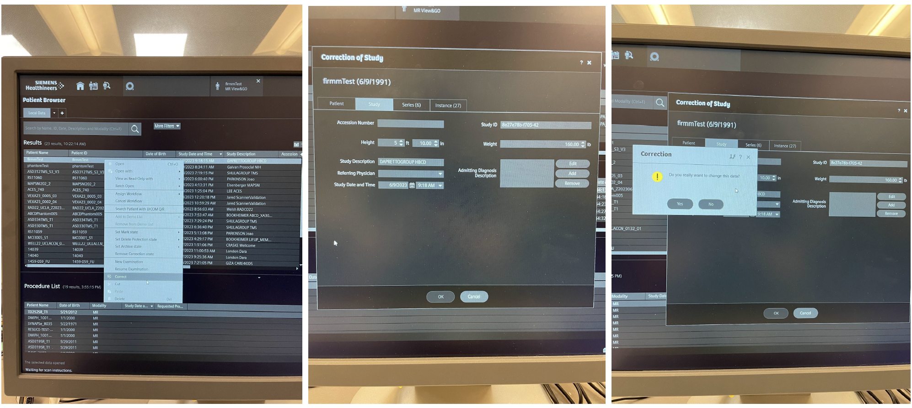

Future Content
--------------

Troubleshooting
~~~~~~~~~~~~~~~

**Console**

Adding/Deleting Sequences During a Scan

- To stop a sequence that has started: Click the button with the red square on it at the bottom of the screen.
- To start a stopped sequence from the beginning: The sequence you stopped will now be greyed out on the list, as if it had completed and the program is ready to continue on. Right-click the sequence you just stopped and click "Rerun from here", assuming the scan you stopped was the one that had just started and you intend to run the rest of the card from there. If you are trying to redo a sequence that you stopped several series ago, copy it down by clicking on it and dragging it down to when you would like it to be run.
- To delete an upcoming sequence: Right-click the scan and click "Delete". This will remove it from the card you are currently running, but will not delete it from the exam card as it was designed and intended to be run. As such, if you are pressed for time and need to make a real-time decision to skip sequences, be assured that you can delete them from the currently-running program and the entire original card will still appear the next time you start the study.

Closing a Patient

- Click the "Patient" tab at the top left of the screen and choose "Close Patient". You will need to do this if, for example, you realize the patient has been registered incorrectly and you need to redo it, or you need to end the scan.
- If you are trying to do this while paused between sequences, you may find that the "Close Patient" option is greyed out and you cannot click on it. Start the next sequence and stop it again immediately--the "Close Patient" option should now be available to you. This occurs because the software automatically prepares the next sequence after it finishes the current one, so you cannot close out when the scanner is already primed to continue. Allowing the primed sequence to begin and stopping it tells the system that the user wants the procedure stopped and it is now okay to close out the registered patient.

Editing Registration Info

1. Navigate to the patient browser by clicking on the “Person being hit by a tennis racket” icon at the top of the computer screen
2. Right-click on the subject ID you would like to correct and select ‘Correct’ from the option menu
3. A Correction of Study window will appear

Peripherals Setup

iMac Won't Accept Password

- Make sure you have the correct password (message CCN admins if you can't remember).
- Restart the computer. Sometimes the iMac will give you a "Welcome" message as though it's logging in, then kick you out anyway with an "incorrect password" warning. Rebooting seems to resolve this.

Task Fails to Trigger

- Exit your task (and ideally its entire host program) completely.
- Unplug the trigger cable.
- If there have been any shenanigans with the button box, re-configure those settings in the controller box now.
- Plug the trigger cable back in and start your task again.
- This restart routine is usually sufficient to fix trigger problems because most of them arise from the task program not communicating with the task computer correctly. Matlab in particular can be finicky about this--for example, unplugging and re-plugging the trigger USB while Matlab is running will cause unreliable behaviors that often affect downstream functionality (such as the scan triggers and button box responses). If you are using the eyetracker, multiple calibration/validation attempts have also been observed to cause problems with task triggers.

Troubleshooting Connection Issues

- When the USB labeled trigger/button box is plugged into a machine, the 'USB' light on the button box interface should be static; when not plugged into anything, it will flash.
- If you notice that the 'USB' light on the button box is flashing while the USB is plugged into your machine, test the USB on a different machine (like the iMac). Oftentimes the USB port may not be recognizing that there is an input being plugged in, and the machine may need to be restarted.

Screen(s) Fails to Display Task

- Make sure that the correct input option is selected on the AV box.
- Look at the front panel of the black box on the control room desk. Check that the light to the RIGHT of the input you want (DisplayPort, HDMI, etc.) is lit orange. If not, simply press the correct button.
- Try another cable. If you usually use DisplayPort, you can try HDMI, or vice versa.
- Try an(other) adapter. There are several in the box by the window (please return whatever you use to the box when you're done).
- If you usually duplicate displays, try extending. Certain laptops and/or programs are susceptible to crashing in mirror mode specifically.
- Reset the AV box. At the leftmost edge of the front panel of the box, there is a power button. Press it once to turn off, then again to turn back on.

Button Box Fails to Respond

- Redo the settings on the controller box as outlined by the instructions taped directly above it. Remember that steps 3 and/or 5 will be different depending on whether you are using the 2-button box, 4-button box, or trackball mouse.
- Make sure the grey trigger cable is connected firmly.
- If you replug the cable, it is recommended that you also close out your task program. Plug the cable back in, then restart the program. Some software will run a check on all connected devices upon startup, so if you replug a cable while it's already running, it may not detect the connection.
- Make sure the cables in the scanner suite are connected firmly.
- If one or more buttons are still not responding, ask the MR Tech for another box. There are spares in the drawer beneath where the test magnet and thermometer are kept. Remember, do NOT bring the demo button box from the testing room into the scanner room--it is NOT MR safe.

Pulse Monitor Doesn't Work

- Note that the HR monitor needs to be close enough to the scanner before the computer in the control room can detect it on the physiological display. The screen on the bore will also show the physio readings and relevant error messages when it senses that the monitor is nearby. If you try to test or check the monitor device from the control room, the waveform won't change and the battery icon will be red regardless of actual charge.
- The small square lights on the top left of the device are the charging indicators. They will flash green when the device is successfully charging.
- The small light at the top right corner of the device is the finger detection indicator. It will shine red when the sensor is not successfully picking up on a physiological signal. The bore screen will also display an error message. When you see this light and/or error, it means no finger is detected--whether this be because there is no finger in the clip yet, the finger is improperly positioned in the clip, or the sensors in the clip are not positioned correctly to pick up on the signal.
- The most common reason for the HR monitoring device to fail is insufficient charge. It is easy to replace the device in the the charging port and unintentionally leave it in a discharging state by not pushing down all the way. If the charge is depleted, you probably won't be able to restore charge quickly enough to use it for your current scan, unfortunately. Replace the monitor in the charging port and make sure you plug it in completely (the little squares at the top will flash green).
- If the charge seems fine, look inside the finger attachment. There are two small, oval-shaped holes inside: a red light is projected through one and received by a sensor in the other. Make sure neither the light nor the sensor are occluded by the attachment. Check that when you put the monitor on, the light is over the fingernail.
- If you do not see the red light at all, the sensor loop has gotten shifted around and is now positioned incorrectly within the clip. Remove the rubber finger attachment completely by gently pulling on it--it should slide off easily. Straighten out the sensor loop inside and replace the attachment so that the red light properly shines through one of the holes. Make sure the sensor is not blocked on the opposite side of the light, then try inserting a finger again.
- If nothing seems to be wrong with the sensors, check the finger attachment itself. Make sure it is undamaged and snugly encases the sensor loop inside. If the attachment is ripped or missing, there are new ones in the scanner suite in the labelled drawer with the other physio equipment. If it does not appear damaged, clean it thoroughly and try again. Sometimes a careful cleaning helps recover the sensor's sensitivity.

**Scanner Suite**

Blankets

- If there are no more blankets in the cabinet, spare linens are in the tall cabinet marked "Linens" by the corner desk in the main room. Many other spare supplies will be there, including scrubs and mesh covers, in their respectively labelled cabinets.

Linens Basket

- When the linens basket is full, tie up the bag containing all the used linens and take it out into the main room. Leave it against the wall by the scale and hand sanitizer station adjacent to the sink.

Fans

- There is a small fan that runs continuously in the room, on the floor between the coil rack and the counter. It is turned off for concurrent EEG-fMRI data collection. If you are not running one of those studies and notice that the fan is turned off or out of place, orient it toward the bed and turn it back on.
- If you notice that the fan has been significantly moved from its usual spot, notify CCN staff. Because the back of the device contains weakly ferrous components, the fan is tied to the coil rack and weighed down with sandbags. It should never be far away from its usual position on the floor, so alert CCN if it is.

Scan Failure

- Sometimes, if the coils aren't plugged in correctly or if the scanner has been working continuously for a long time, unusual things will happen during your protocol. These issues may include your scan not starting or acquisition stopping mid-sequence with strange activity on the bore screen.
- In some cases, it may be necessary to reboot the system (and in fact, restarts are conducted regularly outside of operating hours to keep data acquisition running as smoothly as possible). Before restarting the whole system, however, first determine if your issue can be resolved by other methods.

Retry the Failed Series

- Right-click > Rerun From Here on the sequence that acquisition failed on. Start-stop if necessary.
- See "Adding/Deleting a Sequences During a Scan" further above on this page for help with this.

Re-plug the Coils

- This can help if you notice your sequence refusing to start (e.g., the status says "Preparing...", then cycles back to "Waiting for User to Continue" without doing anything). Other typical accompanying errors include "Preparation of measurement system has failed" and "failed to converge".
- Move the bed back to home.
- Remove the participant or at least have them sit up.
- Unplug the coils. Make sure the posterior coil is flush with the back of the bed and not sitting crookedly in the square space. Plug the coil back in.
- The 32ch coil is sensitive to positioning inconsistencies. Be aware that just being able to push the plug into the port isn't enough--make sure the posterior coil is completely flush with the back of the bed and everything is lined up straight. When the posterior is plugged in and ready, you should be able to push it (in the direction of the bore) and feel no movement at all.
- Confirm there are no coil file errors on the bore screen and no System Check errors on the console.
- Re-align and send the participant back to isocenter. 

Reset the Bed Alignment

- Re-aligning the bed can help resolve the issue in which the bore screen reads "Isocenter" in positions that are not isocenter. This can be done even while you have a participant on the bed--just be sure to talk them through what's happening.
- Move the bed back to home.
- Unplug and re-plug the coil connections.
- Lower the bed down (as if you were preparing to have a participant climb up or step down).
- Move the bed back to home. Re-align and try moving to isocenter again.

Completely Redo the Patient Setup

- Close out the subject.
- Redo the prep as if you were just beginning a new scan:
- Move the bed back to the home position. Unplug and re-plug the coils. Re-navigate the bed to isocenter.
- Re-register the participant. You can use the same Subject ID if you'd like--everything is timestamped, so the console will allow you to do this. You will just get multiple subdirectories under that ID's folder in the DICOM server, differentiated by timestamp. If you'd rather have the new attempt saved under an entirely new folder at the Subject ID level, use a different ID.
- Try running your protocol again.

Restart the Scanner

- If nothing is working, a reboot may be in order. Open the Staglin Operating Manual on the iMac computer to refer to the instructions for Standard Shutdown and Reboot Procedures.
- If you have never rebooted before or have questions about the process, contact CCN staff to help walk you through the reboot steps.
- This will take about 15 minutes from beginning to end, so make a decision appropriate to your participant's and the users' availability.
- Inform CCN personnel about any persisting errors.
