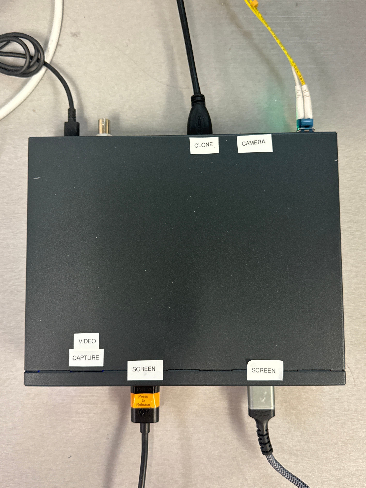
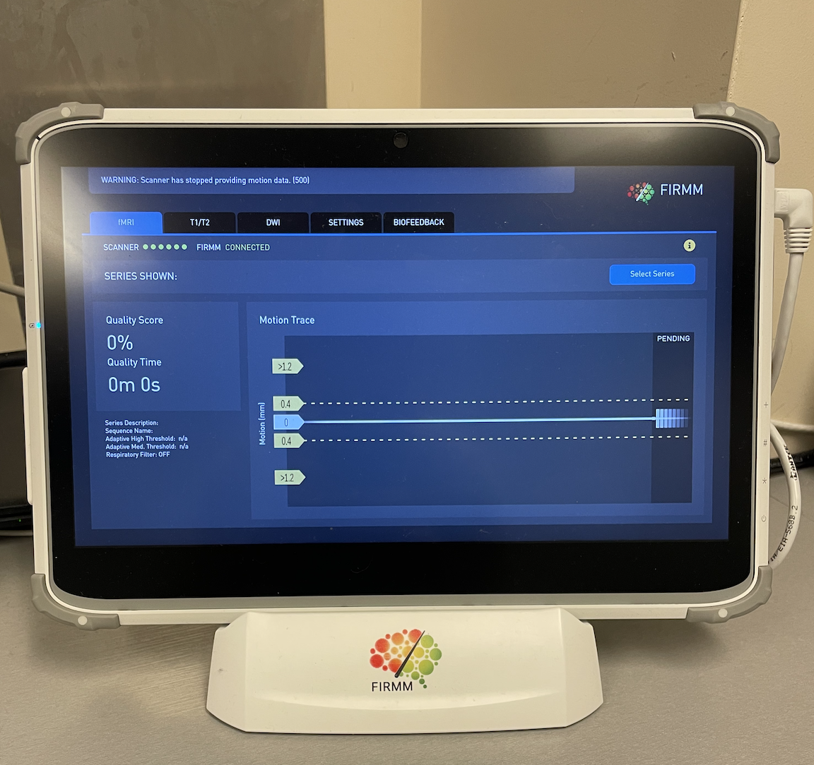
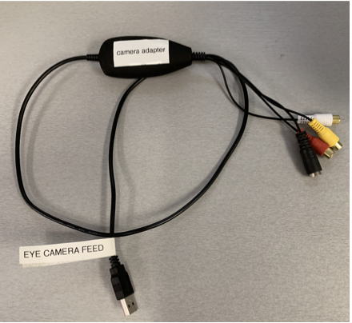
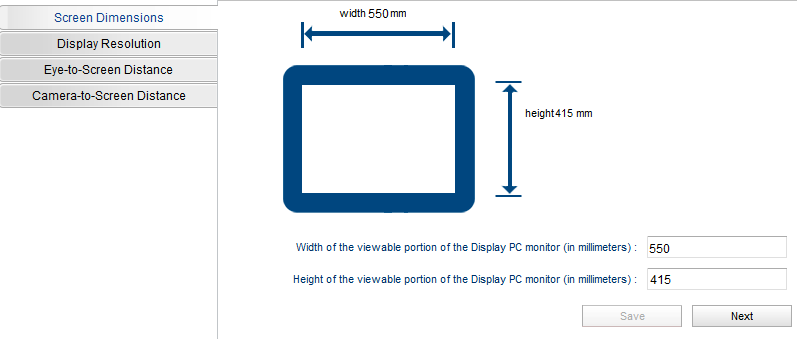
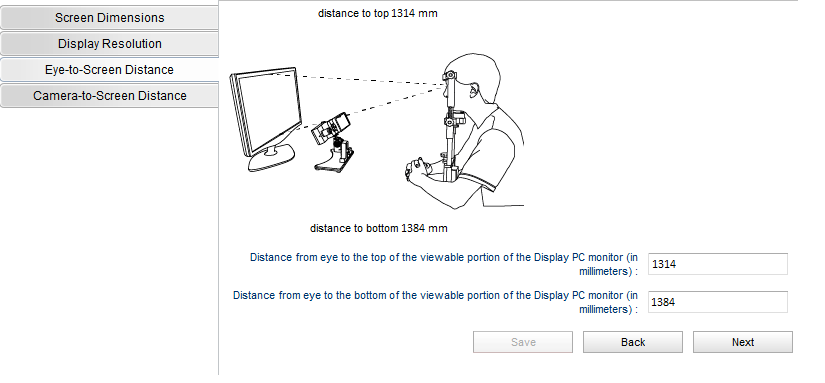
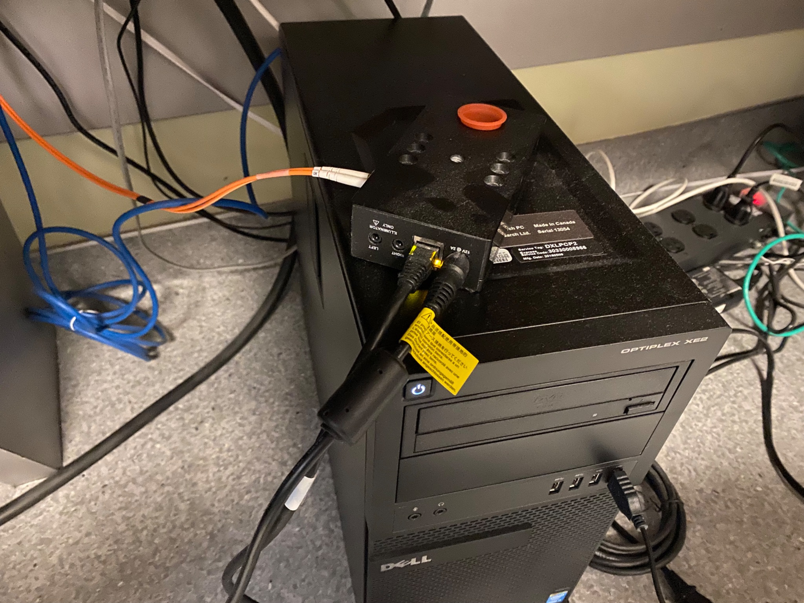

Future Content
--------------

Peripheral Equipment
~~~~~~~~~~~~~~~~~~~~

**Opto Acoustic Noise Canceling Headphones**
============================================

`OptoACTIVE II <https://www.optoacoustics.com/medical/optoactive-slender>`_ slim, over-the-ear headphones with an active noise cancellation (ANC) feature.

Setup

Please use the sanitary headphone covers located in the middle cabinet inside the scanner room. Do not clean the headphones with the wipes. Commercial cleaning products will cause the material to degrade and crack over time. We will then have to repair the headphones with electrical tape or replace them.

1. Turn on power (top-right button on the back of the unit) and the display should appear (image 1 below). 
2. Make sure the audio cable isn't plugged into anything. Touch "Touch screen to continue" and then "Start" to move to the calibration screen (2).
3. Firmly touch "Calibrate" to begin calibration. During this step, absolute silence is necessary--no scanner noise and no audio. If calibration is successful, a green checkmark will appear next to the Left and Right calibration boxes. (3)
4. Once calibrated successfully, touch the ANC button in the upper right-hand corner of the screen.
5. Touch "Learn" to begin the algorithm's learning phase. (4) This sequence should be run before the task sequence and allows the noise cancellation algorithm to learn the noise coming from the scanner. If the audio cable is plugged in, make sure no audio is being played or else the learning will fail. The learning sequence should be at least 30 seconds long and should be the same exact sequence type being used for your fMRI tasks. (5)
6. Once the learning phase is complete, check that the yellow status box that said "Learn" is now green and says "Noise Cancellation". If it doesn't (e.g., it reads "Idle" or "Passive" instead), press the ANC button. The status should change and there should be a significant decrease in the scanner noise heard by the participant. (6) 
  - This is signified by the decrease in the dB value and the dB waveform seen on the screen for each ear.
  - Note that in Image 6, the red line is flat because the sequence had been stopped at the time the picture was taken. During your active scan with noise cancellation being performed, the red line should look similar to the blue line.
7. The algorithm will remain active unless stopped by the user or the system (see Troubleshooting).
8. Press STOP if you wish to pause the application of noise cancellation (e.g., to talk to the participant). Press ANC to start it again.
9. Press the switch on the back of the box to turn everything back off at the end of your scan. Leaving the unit on for long periods of time may cause it to exhibit unusual behaviors, such as struggling to turn back on again.

+---------------------------------------+-------------------------------------+-----------------------------------------+
| .. image:: images/opto_homescreen.jpg | .. image:: images/opto_start.jpg    | .. image:: images/opto_calibrate.jpg    |
|    :width: 150px                      |  :width: 150px                      |  :width: 150px                          |
|                                       |                                     |                                         |
|**Figure 1.** Homescreen               |**Figure 2.** Press Start            |**Figure 3.** Calibration successful     |
+---------------------------------------+-------------------------------------+-----------------------------------------+
| .. image:: images/opto_learn.jpg      | .. image:: images/opto_learning.jpg | .. image:: images/opto_ANC.jpg          |
|    :width: 150px                      |  :width: 150px                      |  :width: 150px                          |
|                                       |                                     |                                         |
|**Figure 4.** System ready to learn    |**Figure 5.** 1.7 seconds until      |**Figure 6.** Cancellation active        |
|                                       | learning complete                   |                                         |
+---------------------------------------+-------------------------------------+-----------------------------------------+

BOLDscreen 32" UHD LCD Display
==============================

Product site: https://www.crsltd.com/tools-for-functional-imaging/mr-safe-displays/boldscreen-32-uhd/

Specifications:

- Active Area: 698.4 x 392.2 mm
- Pixel Dimensions: 3840 x 2160
- Refresh Rate: 60 Hz
- Pixel Pitch: 0.181 mm
- Contrast: 3000:1
- Luminance: 300 cd/m2
- Distance from isocenter: 121 cm

**Setup**

If everything is working correctly, setup should be quite straight forward. The BOLDscreen connects via HDMI or DislpayPort cable. Both are labeled "SCREEN".

- Plug in the display cable to the stimulus laptop or CCN iMac, and the BOLDscreen should mirror the display exactly.
    - Often an adaptor is required. CCN offers all the usual adaptors needed (HDMI to USB-C, Mini Display, VGA).
    - Please note the Mini Display adaptor only connects in one direction! This is important so you don't damage the display port on the iMac or other devices.
- There is an external monitor located to the right of the console computer, which should mirror the BOLDscreen so users are able to see what the participant sees. To connect to this monitor, connect the cable labelled "MONITOR" to the port on the box labelled "CLONE".

Current Designs Response Devices
================================
Current Designs: `Product Site <https://www.curdes.com/>`_

- CCN is currently outfitted with four MR safe response devices: 2 Button Inline Box, 4 Button Inline Box, 4 Button Diamond Box, and a Track Ball
- CCN is also equipped with a USB 4 button practice device for use in the testing room outside of the scanner: **This device is NOT MR safe and should not enter the scanner room at any time!**

**Setup**

Device Connection:

1. The three response devices are located in a drawer inside the scanner room labeled "Button Boxes"
2. Take one of the devices and remove the small rubber cap located on the connector
3. Remove the top optical bundle from the wall, and remove the rubber cap from the bundle connector

  - Carefully put the two caps somewhere they won't get lost. The ledge of the window between the scan suite and control room is a good option, because you will see them when you loop the optical cable back up at the end of the scan.
4. Gently find the correct orientation for the two connectors to interlock

  - Once the correct orientation is found, connect the button box to the fiber bundle
5. Back in the control room, follow the instruction sheet attached to the desk above the silver button box interface in order to select the correct device and settings

  - Steps 3 and 5 will be different for the trackball mouse. Choose HHSC-TRK2 and HID TRACK COMP for those steps, respectively.
6. Once settings have been selected, please make sure your subject tests the buttons before continuing

FIRMM
=====

FIRMM can track bold EPI, Diffusion, and volume navigator (vNav) T1 and T2 sequences.

XA30
FIRMM on XA30 is seamlessly integrated and starts automatically via settings in the bold, diffusion, and vNav sequences. No user input is necessary.
If your project would like to utilize FIRMM, please reach out to CCN techs.
Of note, there is a bug whereby using FIRMM disables the automatic copy reference feature. As the scan runs, you will be forced to double-click each referenced sequence to reopen it and re-apply the prescription before it will start. This can be done, but may introduce small differences in the FoV in your final data set. It is up to you to decide if the FIRMM/copy-reference tradeoff is worthwhile for your study.
As of August 2023, this is a known issue with Siemens workstations and Siemens is working on the problem.

Eye Camera
==========
**Setup**

The camera feed adaptor should be located on the desk behind the console monitor.

- Make sure the camera feed is plugged into the yellow component of the adaptor, and the USB is plugged into the CCN iMac.
- Open up the ezcap VideoCapture software on the CCN iMac.
- If the ezcap application is already open, quit and reopen before moving on. Sometimes the USB is not read properly if opened before connecting USB.
- After opening the program two windows will popup, these are normal.
- Navigate to the top of the screen and click on the Digitizers menu and select ezcap VideoGrabber. This should bring up a video feed in a separate window.
  
  - If this doesn’t work, restart the ezcap VideoCapture software and try again.
  - If no video feed is present, please email the MR Tech.
- CCN has a camera attached to the top of the bore in the instance research groups would like to monitor their subject's wakefulness but have no need for the eye tracking metrics.

Eye Tracking
============
MR Compatible EyeLink 1000
CCN is equipped with an in-bore `EyeLink 1000 Plus - Long Range <https://www.sr-research.com/fmri-meg-systems/>`_.

**Setup**

In Scanner:

The eyetracker is installed in the back of the bore. It should stay behind the blue tape marking the best position on the rail.

There are three cables that need to be attached when you begin an eyetracking session:

- Two thick, black cables: Power cables. Plug them into the two round ports on the back of the eyetracker (doesn't matter which one goes on which side).
- One skinny, orange cable connected to a blue cable: Fiber optic cable. Plug it into its port on the back of the eyetracker.
- Remove the lens cap. Place it somewhere nearby so you can find and replace it again easily when your scan is complete.
- There is another camera mounted to the inside of the bore, right above the eyetracker. You may want to unplug this camera before you being your eyetracking session, as the infrared light it emits may interfere. If you unplug this camera, please remember to plug it back in when your scan is finished.
- If your group is finding it difficult to re-plug the camera after scans, whether it be due to time or memory constraints, you may find it helpful to simply cover the camera using one of the mesh headphone covers. This is an acceptable alternative as long as you are mindful not to use an excessive number of covers per week.
- At this point, the Eyelink desktop computer in the control room can be turned on. The camera now needs to be aligned so that it points at the participant's (usually right) eye, reflected in the mirror.
- Remember to use the mirror dedicated to eyetracking, not the usual coil mirrors. The eyetracking mirror is stored in the control room cabinet and labelled with EYETRACKER.
- Do not clean this mirror using the wipes. They will degrade the reflectiveness over time. Use the special cleaning products stored in the same cabinet that the EYETRACKER mirror itself is kept in.
- Once the participant is inside the bore, adjust the alignment as necessary. You may need to play around with both wheels until a stable image is achieved:
  - Wheel close to lens: Focus wheel.
  - Wheel close to base: Aperture wheel.
  - Large knob near the base: Adjust eyetracker positioning in all directions.

In Control Room

At the Eyelink station on the right side of the room, there is a cable with a yellow tag on it and is attached to a battery box labelled EYELINK (pictured below). This is the transducer cable--plug it into the rightmost port (labelled with "12V") on the box on top of the tower unit.

Transducer cable plugged into the Eyelink box.

- Plug the eyetracker ethernet cable into your task computer. This will be the blue cable labelled EYELINK.
- Make sure your computer network is set to use this connection. This will be how your computer communicates with the Eyelink station to run calibration and record fixations when your scan starts.
- Once the cables are connected to the eyetracker in the bore, turn on the tower unit. You will likely get errors if you try to power on before those cables are connected.
- The main Eyelink menu screen should appear, now that all the cables are connected and the computer is powered on.

Calibration

- Click on the center of the eye to put the red circle around the pupil.
    - Set the thresholds so that the cross locks on to the center of the pupil and maintains as stable a tracking as possible:
    - Start by clicking "Auto Threshold". Eyelink will give you its best estimate of what threshold values give you the most accurate capture of pupil and corneal reflection.
    - Adjust the pupil threshold until the dark blue (pupil) fills as much of the pupil as possible without including too much non-pupil (e.g., eyelashes).
    - Adjust the CR threshold until the light blue (corneal reflection) circumscribes a spot on the pupil without including too much non-CR (e.g., the coil).

- Once the threshold settings are as stable as you can get them, click "Calibrate" on the right side of the screen to begin calibration.
    - The details of running the calibration will depend on how the corresponding script is written on your task computer's side. You will need some code that tells Eyelink when to present a fixation cross and when to accept fixations.
    - This can be a relatively simple Matlab script with just a few commands for having the user decide when to show a cross, accept a fixation, show the next cross, and exit the script when calibration is done.
    - "Auto-trigger" is off by default. You will most likely want to keep this off.
    - Other settings will depend on your lab's preferences. For example, there are different calibration types that will present fixation points in various configurations, such as a row of three, a triangle, a five-point cross, or a full-screen grid. "Force Manual Accept" will tell Eyelink that you want the program to wait for you to press a key in order to accept the calibration attempt on a particular fixation point before moving on. There are a number of other settings--make a note of what your lab wants to do so it will be consistent across all your participants.
    - If you are using manual accept, you generally want to accept a corresponding fixation very quickly after presenting a cross. This is because a person's immediate saccade to a new fixation point tends to be the most accurate. Once they fixate, the eye often drifts off even if the person feels like they are still focused on the cross.
    - During calibration, the crosses look like they appear at the edges of the screen while the fixations do not. This is normal--the fixations will look clustered around the center of the screen, but as long as they make a generally rectangular shape, calibration is working correctly.

- Click "Accept" and "Validate" to validate the calibration once it's complete. This will run you through another (similar, but not identical) process to verify the calibration results.

