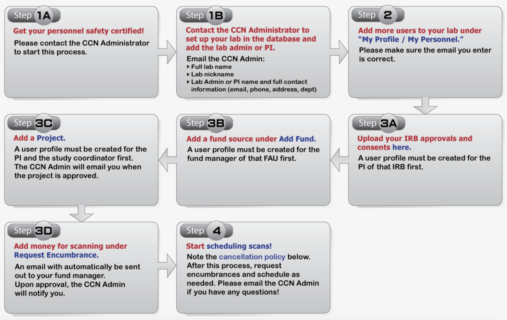
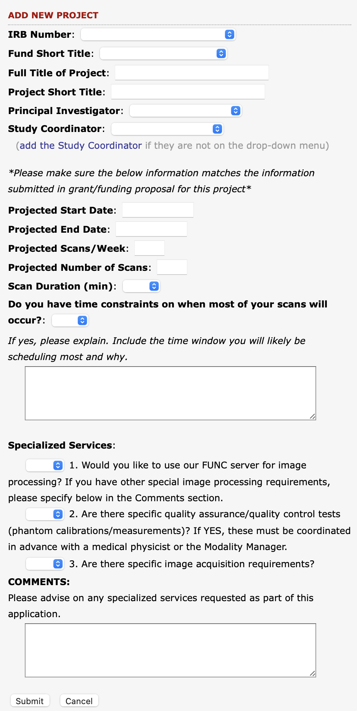
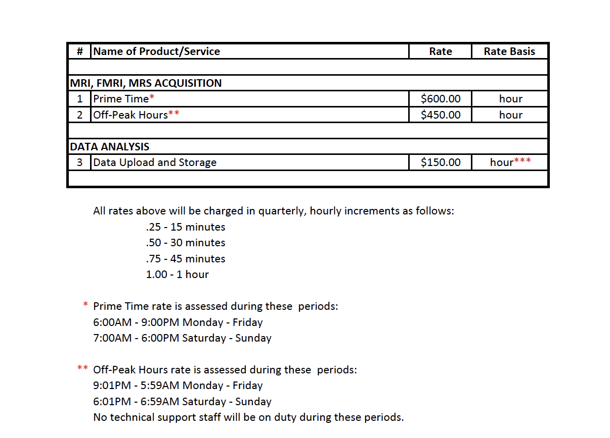
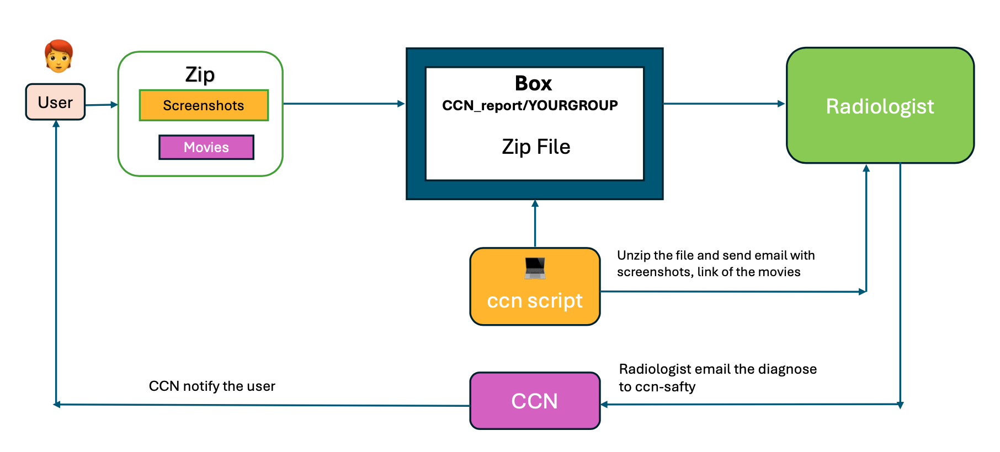

MRI 
===
Safety Certification and Training
---------------------------------

.. _safety_cert:
1.1  How to Get Safety Certified
~~~~~~~~~~~~~~~~~~~~~~~~~~~~~~~
CCN safety certification is achieved using a combination of in-person sessions and remote work via the Staglin Safety and Training Course on `Bruinlearn <https://bruinlearn.ucla.edu/>`_. You can log into BruinLearn with your UCLA credentials, but will need an enrollment link to register for the Staglin Center Safety module for the first time. Please get an enrollment link from your lab manager or the #ccn-resources channel on Slack. Only contact CCN personnel after first checking with your lab admin and the Slack channel. The enrollment link is not posted on this wiki for security reasons.

- Overview: The process is summarized as follows and the BruinLearn module will guide you through the steps once you begin:

   1. Review the safety materials, upload your metal screen form, and pass the MR Safety Exam (on BruinLearn). Once you have passed, check the BruinLearn calendar regularly for Walkthrough and Operations Training sessions. Sign up for an available pair of trainings when you find one you can attend. The Walkthrough and Operations sessions should be one week apart. You should not sign up for a Walkthrough without its corresponding Operations, or vice versa, unless you have explicit permission from CCN staff. If you sign up for a disjointed pair of sessions, or for multiple sessions, it causes problems for other users trying to get certified and your signup will be cancelled.
   2. Attend a Walkthrough Training session (in person at CCN).
   3. Submit the Walkthrough Worksheet and pass the Walkthrough Exam (on BruinLearn).
   4. Attend an Operations Training session (at CCN).
   5. Pass the Operations Exam (on BruinLearn).

- Step-by-Step Guide: See `this document <https://docs.google.com/document/d/1O_xt0fdFmxP1JE7NKGeT_fQSYbvwXxtdP51_UB-ksH4/edit?usp=sharing>`_ for detailed explanations of all requirements related to safety certification and user status. It walks through the entire process of becoming safety certified, with screenshots, starting from the first step of accessing BruinLearn.

.. _renew_cert:
1.2  How to Renew Safety Certification
~~~~~~~~~~~~~~~~~~~~~~~~~~~~~~~~~~~~~
- Safety certification expires after one year. Every safety-certified user is required to renew their certification annually.
- To get recertified, log into BruinLearn, click "Modules" in the left-hand sidebar, and scroll down to the Recertification Module. Complete the two requirements:

   1. Fill out an updated metal screening form for yourself. This form must be resubmitted every year to make sure you as a CCN user do not have any new implants or devices that preclude you from entering the MR environment.
   2. Pass the MRI Recertification Exam. There is no password necessary to access it.

- Email CCN staff as instructed by the module when you have passed both requirements.
- Please only email CCN staff about recertification if you have passed these requirements, are experiencing BruinLearn issues, or have questions about the conceptual materials. Consult your labmates and carefully read the detailed guide linked above before sending CCN questions about how to get recertified.

.. warning::

   **IMPORTANT:** If you have not scanned much or at all in the interim year between (re)certifications, passing the Recertification Exam will not be sufficient to  recertify you. *CCN will request that you repeat some or all of the full certification process.*

   This is an important precaution to make sure that every CCN user is familiar and up to date regarding safety protocols and equipment. If you have not been regularly scanning at CCN since you were last certified, email ccnsupport@g.ucla.edu to discuss your situation.

1.3  FAQ: Safety Certification
~~~~~~~~~~~~~~~~~~~~~~~~~~~~~

**I've been safety certified with CCN before. How do I get recertified?**

- See the previous section: :ref:`renew_cert`. To summarize:
- **Users who have been actively scanning at CCN since they were last certified**: Follow the instructions in the Recertification Module on BruinLearn. You will need to submit an updated metal screening form for yourself and pass the MRI Recertification Exam.
- **Users who have not been actively/regularly scanning at CCN** since they were last certified*: The online MRI Recertification Exam will not be sufficient to renew your certification. You will need to repeat some or all of the full certification process. Email ccnsupport@g.ucla.edu to discuss your situation.
- **Users whose certification has expired**: This indicates that you have not been actively scanning at CCN for quite some time, because only users with un-expired certification can be scheduled on scans. You will need to repeat some or all of the full certification process. Email ccnsupport@g.ucla.edu to discuss your situation.

**I was certified a few years ago. Can I just take the Recertification Exam or skip some of the certification steps?**

- No. Safety is always the top priority. CCN must be fully confident that all certified users are prepared to respond in an emergency situation. Even if you were a PI or have been scanning at another institution in the meantime, there is no way to remember all of the crucial information covered during certification training if you have not been active at CCN since you were last certified. Even though MR safety principles are the same regardless of institution, each site is different and the locations of emergency buttons and tools will be different. The course materials, assignments, and exams themselves are also periodically updated.

**I can log into BruinLearn, but don't see the Staglin Safety course.**

- This means you are not yet enrolled in the course. Please talk to your lab manager or admin for an enrollment link. Only email CCN staff if they do not have it. The enrollment link is sent to the PI and lab managers/coordinators when they are first certified at CCN and it is their responsibility to note and distribute it to future lab members who need certification.

**I got the enrollment link from my lab admin, but clicking it gives me a Page Not Found error.**

- Make sure you are able to log into bruinlearn.ucla.edu with your UCLA credentials. Do not use Mednet credentials, as BruinLearn requires a @ucla.edu address to enroll.
- Try again in 24-48 hours. UCLA credentials that were granted very recently to new employees/students take some time to propagate through the system.

**I passed the MR Safety Exam. Now what?**

- Monitor the BruinLearn calendar for Walkthrough and Operations Training sessions. Sign up for a pair of these sessions as soon as you see an available posting that you can attend.

**I'm on the Calendar page, but don't see any options to sign up.**

- Make sure you click "Find Appointments" on the right-hand side. The detailed guide linked under :ref:`safety_cert` explains this step and many others that are frequently missed -- please read it carefully.
- If you still do not see any options for signing up, it means all current postings are full. CCN staff offers these sessions as often as the schedule allows, but demand for safety certification is usually high and the sessions fill up very quickly. Watch the calendar for cancellations and new postings--BruinLearn sends automatic email notifications (if your settings allow it) about new session availabilities.
- If you have a strict deadline or have been actively trying to find a spot for a long time, email ccnsupport@g.ucla.edu to discuss a special accommodation. CCN will do its best to help, but cannot guarantee anything. Training opportunities are limited by both scanner and staff availability.

**I finished my certification training and passed the exams. Now what?**

- Once you have passed the Operations Exam, you are able to start serving as a safety second for scans. There are no further exams to take or physical certificates to get. You will simply need to be recertified after a year has passed (see :ref:`renew_cert` above).
- Your lab admin will need to add you to your lab's personnel list on SIStat. See the Lab Personnel section on this page for instructions. This will allow us to mark your certified status in the system, your lab to schedule you for scans, and you to book scans yourself.
- After you have gained some experience as a safety second, you will be able to become a Primary or Responsible User. See the section about primary users on this page for qualification criteria. CCN does not stipulate a specific number of required experience hours, as everyone's MR background is different, but will assess each individual's experience level as necessary.
- Contact CCN staff for access to the CCN mailing lists and Slack workspace. These are the primary communication channels for CCN information and announcements.

**I am a certified user, but need a refresher on how to use the scanner console. Can I attend the Operations Training to review?**

- Yes. Attending the Operations Training is required as part of the safety certification process, but established users may also attend if they need to re-familiarize themselves with the system (e.g., after a significant time away).
- Please check the BruinLearn calendar for available sessions and contact CCN staff for permission to attend. Do not just sign up without notifying CCN staff. Because new users must attend a Walkthrough and Operations Training as a pair, there are the same number of available spots in both. If you sign up for an Operations Training without the corresponding Walkthrough, you will take up a spot that a Walkthrough attendee needs. Communicate with CCN so staff can help accommodate your extra slot.

**I am BMC certified. Will I need to get re-certified to be allowed in the CCN scanner and/or to access the CCN server?**

- Yes. CCN and BMC are separate organizations, so you will need to be safety certified at CCN to access the scanner and server.

**Will I get some kind of certificate after I finish safety certification?**

- No. This safety certification procedure is internal to CCN. It does not constitute any kind of approval to scan at other institutions and does not produce any literal certificates.

.. raw:: html

   

Project Management
------------------
SIStat (https://www.sistat.ucla.edu/ccnsas/login.asp) is the platform CCN uses to manage all scan-related activities. It is hosted by the Semel Institute Biostatistics Core and will serve as your hub for:

- Uploading your IRB approvals
- Encumbering funds so you can bill scans to your project
- Adding certified personnel to your lab/project
- Scheduling and cancelling scans

The diagram below provides an overview of the steps required to set up a project on SIStat, from the perspective of a completely new lab with new users. Keep this workflow in mind as you read through the following sections.
For any questions (and Step 1B, referring to the CCN Administrator), please contact ccnsupport@g.ucla.edu and cc Marlo Duran at mdduran@mednet.ucla.edu. 

2.1  Getting a SIStat account
~~~~~~~~~~~~~~~~~~~~~~~~~~~~
**New user under existing lab:** Your lab can create an account for you. See :ref:`add_user` below. This also applies to users who need to access SIStat, but do not scan (e.g., schedulers and fund managers).

**New user with new lab:** CCN will need to create your lab in the system, then add the PI. The PI can then add lab members from there.

2.2  Adding personnel to your lab
~~~~~~~~~~~~~~~~~~~~~~~~~~~~~~~~
Information about your current lab members can be found under General --> My Profile | My Personnel.

.. _add_user:
**Adding a New User**

The lab PI or coordinator should have administrative privileges to add new users to the lab.

1. Navigate to "General" → "My Profile | My Personnel"
2. Click the "User" dropdown menu and first check to see if their account already exists. This will be the case for most fund managers and users who are/were affiliated with other labs. If the user does not already exist, select "Create Passport For New User"
3. Input the new user's information. Only the bolded fields are mandatory. Either create a strong password for them or make a simple one they can change easily to a strong password of their own. Do NOT leave the password field blank.
4. The new user will receive an email with their login credentials.

(*If this new user just completed safety certification:*)

5. Once the account is created, please email ccnsupport@g.ucla.edu to activate the account and input their certification information. SIStat does not notify CCN when accounts are created, so if you forget this step, CCN staff will not know there is a new account to be activated. The new user will not appear in SIStat as a Primary/Secondary User scheduling option until the lab sends CCN the email and receives confirmation that the process is complete. Either the user him/herself or the lab member who creates the account can email CCN with the notification--just make sure nobody forgets/delays this step or you will only find out when you try to schedule the new user for the first time.
6. Every new user receives an email summarizing these instructions at the end of the certification process. These steps are also discussed verbally during the final in-person portion of the process (Operations Training).

**DICOM Accounts**

CCN maintains a DICOM server that raw imaging data is automatically transferred to as it is acquired. Each lab has their own directory. As such, lab members involved in checking/analyzing the data will need DICOM accounts to access their lab's folder. To apply for a DICOM account:

- Send an email with the following information to the CCN Programmer Analyst **Jonathan Hernandez (jonhernandez@mednet.ucla.edu)**
   - Your Hoffman2 account ID if you have one
   - CC your request to the PI whose group directory you need access to for approval
- It is possible to have a SIStat account without a DICOM account or vice versa. The user's role in the lab determines whether they need one, the other, or both.
- If you have an account with the Brain Mapping Center and want access to the CCN DICOM server, you will still need to apply for an account. CCN and the BMC are separate organizations and require separate accounts with separate policies.

2.3  Adding a new project
~~~~~~~~~~~~~~~~~~~~~~~~
Navigate to Project --> Project Management. The left side of the page will be titled ADD NEW PROJECT and display the required fields for the user to fill out. This includes IRB, Funding, and PI, as well as project-specific information regarding start and end dates, expected number of scans per week, total scan load, and duration.

All currently active projects should have this form completed. If your project already exists and you need to add this information, navigate to Project --> Project Management in the SISTAT system, click on Edit/View at the right-hand side of the project's name, and fill out the available information fields. These details are very important, as CCN uses this information to assess schedule load and accommodate projects with strict time constraints.

2.4  Funding & Costs
~~~~~~~~~~~~~~~~~~~

**Scan Costs**

- Current pricing for the scanner is set at $600 per hour (incremented at $150 every 15 minutes) during "Prime Time" hours. Please note this is expected to increase to $650 per hour after our Sales and Service contract is reviewed.
- Scanning is priced at a reduced rate for "Off-Peak Hours" and Weekends
Full list of pricing:

**Adding funds**

Funding sources can be added under "Financial" → "Add Fund". You will need the following information:
   1. Funding agency
   2. Active FAU
   3. Start and End date
   4. Fund manager overseeing this fund

New projects must be linked with Active funds.

**Billing and Refunds**

Scan Time: All scans must be paid for. CCN will pay for pilot scans as appropriate (see previous section: Scan Procedures > Pilot Program), but all others are paid for by labs via linked funds. Free scan hours are not permitted by Sales & Service, with the exception of specific technical testing and protocol development purposes, which must first be approved by CCN.

Refunds: Refunds are provided only for CCN-side issues (e.g., scanner problem) or exceptional events beyond the users' control (e.g., earthquake during scan).

Cancelled Scans: See Section :ref:`cancel_policy` below.

2.5  FAQ: Project Management 
~~~~~~~~~~~~~~~~~~~~~~~~~~~

**My IRB doesn't expire. Do I still need to put an expiration date?**

- Yes. In cases of IRBs that were approved without need for continuing review, CCN uses this "expiration" date as a reminder to periodically check in with the PI and be made aware of any changes to the protocol, consent form, or administrative details.

.. raw:: html

   

Personnel Policies
------------------

3.1  User Rights
~~~~~~~~~~~~~~~
All users have equal rights and privileges to perform projects at the center. All users will be treated with respect; failure to do so may result in suspension of scanning privileges. Any user can ask questions and suggest policy changes/additions by reaching out to Executive Committee.

3.2  Scan User Roles & Definitions
~~~~~~~~~~~~~~~~~~~~~~~~~~~~~~~~~~
For the safety of both the participants and the investigators, all scans must have two MR-safety certified investigators in the facility for the entire duration of the scan.

In the event that this cannot be achieved, please make every effort to pull in backup scan team members, contact certified colleagues in other labs, and reach out to the CCN community (e.g., via the #general channel on the CCN Slack workspace). Only request arrangements with one of our MR Technicians as a last resort. MR Technicians are not required to be on the premises during all scans, and cannot be assumed to provide backup support without prior notice.

.. note::
   At least one individual present is required to be a full-time/part-time staff, graduate student, post-doc etc. Part-time paid undergraduate researchers cannot presently act as primary users unless approved by CCN after additional review. Email ccnsupport@g.ucla.edu to request review. See below for a full breakdown of roles and permitted duties.

3.2.1  Primary (Responsible) User Definition
^^^^^^^^^^^^^^^^^^^^^^^^^^^^^^^^^^^^^^^^^^^^

**Allowable Roles:** Full-time staff, Post-doc, Graduate student, or Faculty member

- Can perform all scan related responsibilities independently without the need for supervision
- Will serve as the primary scan operator
- Responsible for assigning tasks to and providing oversight for the secondary user, especially if secondary user has volunteer status

3.2.1  Secondary User Definition
^^^^^^^^^^^^^^^^^^^^^^^^^^^^^^^^

**Allowable Roles:** Any of the aforementioned full-time roles, Part-time paid/work-study students, volunteers

- The scope of a Secondary User's permitted tasks depends on the user's employment status:

1. Full-time roles

   - Allowed to perform all responsibilities independently without supervision of the primary scanner
   - May perform all tasks except operating the console

2. Part-time paid undergraduate/work-study

   - May perform responsibilities explicitly defined in their UCLA approved job description independently without supervision
   - This can include operating the scanner, handling scanner and peripheral equipment, interacting with participants
   - May only serve as primary user with **additional review by CCN**

3. UCLA Volunteer

   - May NOT directly handle participants, coils, or operate MR beds/controls
   - Must ALWAYS navigate the CCN suite under strict supervision of the primary scanner/responsible user
   - May not serve as primary user
   - In the event of an emergency where the primary scanner is unable to perform their duties, volunteer personnel should be trained on stopping the scan and removing the participant
   - Required to undergo full CCN safety training
   - Must be officially onboarded via the UCLA Health Science Volunteer Office and perform duties according to the Staglin CCN Volunteer Addendum
   - See next section for details

3.3  Volunteers
~~~~~~~~~~~~~~
All volunteers who would like to join a lab and gain valuable research experience at the Staglin Center are required to undergo the full onboarding process with the `UCLA Health Sciences Volunteer Program <https://www.uclahealth.org/Volunteer/ucla-health-sciences-volunteer-program>`_.

Their duties and responsibilites are outlined in accordance with the `Staglin Volunteer Addendum <https://drive.google.com/file/d/1zPvjn6u_a6ogrXOi2bJVTLCrzhcw35qz/view?usp=sharing>`_. Please read it over carefully. 

- In short, volunteers are not allowed to have direct physical contact with research participants or operate the scanner unless dealing with an emergency. Their role should be limited to tasks that do not involve handling the scanner or touching the subject, such as operating the task computer. This is true even for volunteers who have completed safety certification.

- All volunteers must still complete CCN's full safety certification process in order to serve as a Secondary User during scans at CCN. This is because, as Secondary Users, they must still be aware of CCN's protocols and prepared to respond in an emergency situation. In the event that urgent, life-saving action is needed, they must already be knowledgeable about emergency equipment and familiar with basic console operation (e.g., "which button stops a scan?"), even if they are not permitted to use it under normal circumstances. 

.. note::

   A volunteer cannot become a Primary User, regardless of how much experience they gain. They must transition to another role if they wish to be a Primary User. A role that is paid in some capacity (staff, grad student, etc.) is most straightforward. Undergrad RAs and work study students may potentially be eligible, but must seek additional approval from CCN staff.

3.4  MR Technician Services
~~~~~~~~~~~~~~~~~~~~~~~~~~
Staglin One Mind MR technicians maintain the MR facility and are available to support experimenters in developing scan protocols and troubleshooting scanner-related issues. If there is an anticipated need for support during scanning, experimenters must contact the technicians well in advance of the scheduled scan.

Contact information is posted in multiple areas throughout the Center (e.g., on the control room wall, by the Eyetracking computer) in the event of unanticipated issues during the scan.

3.5  Observers
~~~~~~~~~~~~~
Persons who have not completed safety certification are not permitted to observe scans or enter the magnet room for training or other purposes. For case-by-case exceptions with respect to scan shadowing, see the sections regarding CCN's Restricted Areas policy and :ref:`FAQ_personnel`.

3.6  Visitors
~~~~~~~~~~~~
As per Staglin One Mind CCN safety protocol, visitors are not allowed in the MR suite without prior approval. Please email ccnsupport@g.ucla.edu to arrange a visit for external groups or individuals. CCN staff will need to set up an Event with UCLA Insurance & Risk Management and create a waiver for the visitors to sign.

.. _FAQ_personnel:
3.7  FAQ: Personnel Policies
~~~~~~~~~~~~~~~~~~~~~~~~~~~

**Why am I not in the user dropdown list when scheduling a scan?**

- The most likely reason is that your safety certification has expired. You can see certification expiration dates in the My Profile > My Personnel page on SIStat. Users also receive an email a few weeks before expiration.

**Can an uncertified person shadow my scan?**

- As per the information above (see CCN's Restricted Areas policy), uncertified individuals are not allowed in the control room unless granted an exemption by CCN. Contact CCN for such an exemption if it's necessary for someone to shadow your scan. Regardless, the uncertified person is prohibited from touching any research equipment and any exemptions granted only apply to a single instance. Users who have started but not finished the certification process are considered uncertified until the full certification is completed. If you have questions about this, please ask.

**Can I be a primary user?**

- See "Scan Personnel" in section for general restrictions on user roles. Current CCN policy stipulates that primary users need to be full-time in some capacity (staff, faculty, postdocs, etc.), with a few exceptions for personnel such as faculty with part-time appointments.

- Primary Users are required to have significant scanning experience. The typical path to Primary status is to gain experience by scanning alongside existing Primary Users in the lab as Secondary Users (safety seconds). CCN does not stipulate a specific number of required scans because we understand that new users come in with different backgrounds and levels of scan experience. Once the Secondary User has become highly familiar with the setup/cleanup process and scan procedures, email ccnsupport@g.ucla.edu (cc'ing the PI and Primaries they have scanned with) to request Primary status.
- If your lab is new or has no current Primary Users for another reason, email ccnsupport@g.ucla.edu and explain your situation. You will need to find other ways to gain scan experience, which may involve scanning with and/or shadowing other labs. The situation becomes more complicated if you need to go from newly-certified to Primary User very quickly. Communicate early and closely with CCN admins to work out a plan.
- If your group needs an undergrad RA or work-study to become a Primary User, please email ccnsupport@g.ucla.edu for review.

.. raw:: html

   

Scheduling Policies
-------------------

4.1  Booking Rules and Policies
~~~~~~~~~~~~~~~~~~~~~~~~~~~~~~

The center does not mandate a strict limit on when scans can be booked relative to the scanning date. However, to foster cooperation and consideration within the community, booked scan times are assumed to be filled (assigned a participant) promptly and booked on an as-needed basis. Scans that are booked in advance, above and beyond the current scheduling norms, will be reviewed by the CCN staff and potentially cancelled. Under current policy, the scheduling rules are as follows:

**4.1.1**  No slot-holding
^^^^^^^^^^^^^^^^^^^^^^
Reserving a scan time and finding a participant later to fill it is not allowed. You must have a confirmed participant for each scheduled scan, at the time of scheduling. You will be required to enter a Subject ID when you schedule a scan, to verify you have a participant planning to use the slot. Conduct the recruitment process accordingly--for example, have the calendar open as you discuss availability with your participant and only book time that they agree to. Do not book time days, weeks, or months ahead with the intention of finding participants to fill them later. We understand that it may feel safer to reserve slots in advance, but many projects are actively scanning at CCN, and it only takes a few instances of this behavior to throttle scan opportunities for everyone.

**4.1.2**  Prime time scan limits
^^^^^^^^^^^^^^^^^^^^^^^^^^^^
The scan limit is 3 scans maximum per project, per week, during prime hours (Mon-Fri, 8am - 6pm). This applies to every project unless you have made prior arrangements with CCN. There are no restrictions after hours (Mon-Fri, 6pm+; Weekends).

**4.1.3**  Appointment reminders
^^^^^^^^^^^^^^^^^^^^^^^^^^^
Confirm with participants at least 5 days in advance of your scheduled scan. If your participant cannot commit to their participation 5 days out, please cancel your appointment at that time so other groups may be able to fill the opening. After reviewing cancellation patterns, it is evident that sessions cancelled ~72 hours or less do not give adequate time for other groups to fill the space, and hours of otherwise-usable time go to waste.

We understand that participants sometimes cancel last minute, no-show, or come in with unexpected safety concerns, but these occasions should be kept to an absolute minimum.

**4.1.4**  15-Minute Gaps 
^^^^^^^^^^^^^^^^^^^^^^^
Scans cannot be scheduled for a time that would leave a 15-minute gap before or after another scan. This helps prevent small intervals of time from accumulating throughout the day and adding up to wasted usable hours.

The only exception is if the user wants to book time that would necessarily have to leave 15 minutes either before or after their reservation. For example, you may book 1-2pm even if the previous scan ends at 12:45pm and the next one begins at 2pm, because there is no way to avoid leaving 15 minutes open at one end or the other. This is permitted because using 60 of those 75 open minutes is preferable to leaving the entire time unused.

**4.1.5**  Subject ID
^^^^^^^^^^^^^^^^
As mentioned above, the system will require a Subject ID to book a scan. This ID will be whatever lab convention you are using for the participant who will be coming for that slot (e.g., "ProjectA_Sub01"--DO NOT use the subject's name or any other identifying information).

**4.1.6**  Protocol ID
^^^^^^^^^^^^^^^^^
You will also be required to enter a Protocol ID at the time of booking. This is the code that identifies the scan protocol you will be running. It will have the format XXX-X.X and is built into every active protocol name. You can find it on your protocol PDF or on the console computer when you pull up your lab's projects. There is no way to access this information remotely otherwise, so make sure your scan team has made a note of each active project's Protocol ID. DO NOT enter IRB or other numbers in this field.

**4.1.7**  Special Accommodations
^^^^^^^^^^^^^^^^^^^^^^^^^^^^
Investigators whose experimental needs do not fit these guidelines (e.g., if the study requires participants to have multiple scans within a specific time window) are encouraged to contact ccnsupport@g.ucla.edu and make specific arrangements.

.. _cancel_policy:
4.2 Cancellation Policy
~~~~~~~~~~~~~~~~~~~~~~~

There is no cancellation fee for scans cancelled more than 72 hours before the scheduled time. Simply log into SIStat and delete your booking from the calendar.

**Scans cancelled within 72 hours of the scheduled time will be charged 25% of the full scan fee.** If you need to cancel a scan within the 72-hour window, please fill out the `Late Cancellation Form <https://docs.google.com/forms/d/e/1FAIpQLSd5d9vuN6ii9h0W9BZ1C1-fspoS5VPB-oMDZHjyql8oSmywzg/viewform>`_ in addition to cancelling the scan in SIStat. The information collected on this form helps CCN monitor patterns to inform policymaking, as well as track cancellation events that merit fee refunds (e.g., fire evacuations).

.. note::

   Once the start time for your scan booking has passed, SIStat will not allow you to cancel it. As such, users should formally delete the scan through SIStat as soon as they know it cannot proceed (e.g., in cases that the participant arrives, but suddenly discloses a contraindication that was not previously known).
   
   Even if the cancellation occurs 5 minutes before the start time, the system will allow it and mark the session to be charged the 25% late cancellation fee. As soon as the start time passes, SIStat considers it complete and indicates the full charge should apply.

If a research group continually falls in the late cancellation range, CCN will ask for information to verify those slots were filled using appropriate scheduling practices. CCN may impose additional restrictions on scheduling (such as limiting the amount of scans that can be booked at one time) for groups that engage in profligate cancelling and/or reserving slots without confirmed participants. CCN has compiled a `list of best practices and recommendations <https://drive.google.com/file/d/1yLR77cLHod_-bwauu4AtoAq51bbiNUgv/view?usp=sharing>`_ regarding how to mitigate late cancellations.

Each funded project starts with two free cancellations and accrues another after every 10 completed scans. When a user cancels a scan late, the system will automatically use a free cancellation if one is available.

.. raw:: html

   

Scan Procedures
---------------

Metal Screening and Safety Clearance
~~~~~~~~~~~~~~~~
All participants need to be diligently screened for contraindications to MR imaging during recruitment. Review and sign the `Metal Screening Form <https://drive.google.com/file/d/1aUwmgXoij_czd8YktXmo0yDLjpqbuUpm/view?usp=sharing>`_ with each participant for each scan session. If there are any items of concern, follow up with your participant for more information, collect all relevant documentation from them and/or their medical team, and pass everything along to CCN staff for a final decision. Do not ask CCN about your participant's implant or device without first researching the relevant background. 

All implants needs to be cleared by CCN *before scanning*. If your participant has an implant, please follow the `instructions <https://docs.google.com/document/d/13g-DVRauCgZAkScw0D5j03cCPeCiu2Fi/edit#heading=h.rgb25in7p2nc>`_ to submit a ticket in our `ticketing system <https://support.idre.ucla.edu/helpdesk/>`_ for clearance. Please keep in mind:

- At least six weeks must pass after any surgical procedure before your participant can be considered for scanning.
- No tattoos or other permanent cosmetics on the face or head. The only exception is eyebrow microblading. To be clear, you should still obtain clearance for other tattoos your participant may have--just be aware that permanent ink of any kind on the face or head (except microbladed eyebrows) automatically disqualifies your subject.

Facility Policies
~~~~~~~~~~~~~~~~~~
**Infection Control**

Please make sure the participant completes the Pre-Appointment Illness Screening Form before arriving at UCLA. You should administer this form either the night before or the morning of their scan appointment. Many other researchers, staff, research subjects, and family members come through CCN, meaning we need to minimize the potential for infections floating around the Center. If your participant fails to clear the illness screening, please reschedule their appointment. Past guidance for infection control policies can be found here.

**Participant Arrival**

Please make sure that your study participants have a direct contact and that lab personnel will be available to take calls and/or respond promptly to texts/emails as the time of the scan approaches. Study participants should not wait inside of CCN unattended. If a participant arrives early and you are part of the research team, make sure someone is available to communicate with the person and direct them to wait on the bench right outside CCN. If you are in CCN and not part of the research team expecting this participant's arrival, it is up to you if you have the time to ask questions and help figure out who their research contact is. Regardless, still ask them to wait on the bench outside CCN.

Scanner Use
~~~~~~~~~~~~~~~~~

**1.1 Pilot Program**
^^^^^^^^^^^^^^^^^^^^^

*NOTE: The pilot program is back! However, please still consider CTSI for funding opportunities.* The Center will consider proposals by members of the UCLA community to access both the scanning and analysis core services for pilot studies without charge to the investigator. Priority will be given to junior investigators and to proposals for novel cognitive neuroscience projects that have a high likelihood of achieving extramural funding. 

See the `Pilot Application here <https://drive.google.com/file/d/1rhfezXO3QP4pV5yjUnNmI8LNkjw7EqS9/view?usp=drive_link>`_! Fill out the application if you would like to apply for scan hours toward a pilot project. Send the completed form to alenarto@g.ucla.edu and make sure to tell us the outcome of the pilot--if it helps you successfully secure funding, this information is crucial to keeping the pilot program going! To submit such a request, email the completed application to the CCN Managing Director. The proposal will be reviewed by the Executive Committee members and CCN personnel will contact you regarding the status of the submission. As stated in the application, if you need more space than provided for any item within please use a Word document to submit your answers.

**1.2 Protocol Testing**
^^^^^^^^^^^^^^^^^^^^^^^^

Each new protocol is granted off-hours time to test and refine the scanning protocol, at no charge. Development (and pilot) time is granted by CCN personnel and booked via SIStat. Please reach out to ccnsupport@g.ucla.edu for instructions on booking development time when your team is ready to test a protocol.

**1.3 Scan Testing**
^^^^^^^^^^^^^^^^^^^^

Each new project is permitted two free scan sessions with a human phantom to ensure that the full setup is functional. The group is responsible for recruiting their own test participant, whose images cannot be used as publishable data, and who must still undergo safety screening despite not being included as a real study participant. All such scans must be booked with free Development/Practice time, assigned by CCN personnel.

**1.4 Scan Time** 
^^^^^^^^^^^^^^^^^

All scans are expected to start and end promptly at the scheduled time. It is the investigators’ responsibility to communicate with the CCN staff and/or other investigators if these times cannot be met. Please note that CCN and/or other investigators may not be able to accommodate requests for change of scheduled time when these are communicated less than 24 hours prior to the appointment.

**1.5 Scan Start and End** 
^^^^^^^^^^^^^^^^^^^^^^^^^^

All users have the right to start their scan on time, no questions asked. Start and stop time includes setup and cleanup--users must build this into their scanner scheduling (i.e., scanner must be ready for next group by their scheduled start time). When possible, try and be flexible. However, if the next group is adamant about starting their scan at the scheduled time, then it must be so. If the current scan is running behind, the current group must make an effort to inform the next group. The next group may then, at their discretion, allow the current group to scan into their allotted time, but this is done as a courtesy and not out of expectation that the next user will provide the same. Projects that continually run over time will be required to book more time for future scans.

**1.6 Data Transfer** 
^^^^^^^^^^^^^^^^^^^^^

All f/MRI data are transferred automatically to a dedicated server and stored for 5 years before being deleted. In cases where data must be transferred manually from any of the computers in the MR suite, please notify the MR Technician to make arrangements. No external storage devices (flash drives, hard disks, etc.) are to be connected to the scanner without prior approval. If data is not visible in the DICOM server 24 hours after acquisition, please contact MR Technician immediately to resolve. Due to high scan load, only 3 days of scan data can be guaranteed to be kept on the host machine at any given time. The onus is on each lab to check DICOM the morning after each scan (data syncs overnight) and make sure all images have transferred successfully. It is not CCN's responsibility to check that data has transferred to the server without issue.

**1.7 Incident Reporting**
^^^^^^^^^^^^^^^^^^^^^^^^^^

Users are responsible for communicating with CCN staff any equipment malfunction or software irregularities that occur during the course of the scan session. This may include scanner error messages which do not allow users to continue with their session, the breaking or malfunction of peripheral equipment etc. Emergency incidents, such as injuries, natural disasters or magnet quench, should be relayed to the MR Tech immediately and CCN's `Incident Reporting Form <https://docs.google.com/forms/d/e/1FAIpQLSckiYXnkzlWcYBfD6BEGTV60Tb36Jj2680Tq8mdw02auoFiKQ/viewform>`_ should be filled out in a timely manner.

Incidental Findings
~~~~~~~~~~~~~~~~~~~

A neuroradiologist is on CCN retainer for reviewing potential incidental findings. **To be clear, you may only submit images for incidental finding review if you have this explicitly described in your approved IRB protocol.** As a reminder, CCN is not a clinical facility, and other than our collaborating neuroradiologist, no CCN faculty or staff are medically trained. For sample language, please refer to the `OHRPP's Consent, Assent, and Screening Templates <https://ohrpp.research.ucla.edu/consent-templates/>`_, in particular the section of the `Biomedical Research Consent Form Standards and Sample Language <https://ucla.app.box.com/v/FR-05f01-Biomed-ICF-Stand-Lang>`_ document addressing clinically relevant results.

**How to report incidental findings:**

1. Create a folder and put in all your images and movie files you want to send to the radiologist. *Please circle the area where you consider an anomaly.*

   - The images should include T1 and T2, and are saved in png or jpeg/jpg formats.
   - (Optional) You can create a "movie" from MRI images to give the radiologist with a fuller, 3D view. This is not required, but often useful in providing more detailed information for the review.
       - CCN offers a script that will create this movie from a nii.gz folder of structurals: gen_movie.py
       - You may also create the movie using your own program. Just be sure it can be paused, replayed, and so on (e.g., a mp4 file). Animation files (e.g., gifs) will not allow the radiologist to carefully inspect the area of concern and are therefore of less informational value.
   - Name your folder that contains all the files with your lab name and subject ID. 

2. Compress the folder with zip, and make sure it's named with your lab name+subject ID.

   - The compressed file should end with ".zip"
   - If you do not zip your folder, the automated script that checks daily for new submissions will not detect it.

3. Upload the zip file to the Box folder, “CCN_report/YOURGROUP”, which should be shared with your lab.

   - Before you upload the files, please make sure the images and videos are in good quality so the radiologist can make the correct decision based on them. No phone pictures of computer screens. If your lab does not have a Box group folder shared by us, please contact ccnsupport@g.ucla.edu so we can set one up for you.

What will happen after you upload the zip file:

Our script will check the Box folder once a day and if there’s a new zip file, it will unzip it and then send an email to the radiologist with the images attached. It will also send the link of the movie file.

Scan Equipment
~~~~~~~~~~~~~~
Peripheral equipment available for projects include:

- Siemens intercom system
- Siemens physiological measurement system: Includes pulse, respiration, and EKG
- VisuaStim digital system by RTC: Includes goggles/headphone/controller unit
- Opto Acoustic Noise Canceling Headphones: Thin profile headphones that fit in 32CH coil with active noise cancellation technology
- BOLDscreen Display: LCD display system controlled via fiberoptic cabling
- Current Designs Response Devices: 4-button, 2-button, and track-ball response devices
- FIRMM: Real-time motion monitoring system
- BioPac MP150: For collecting physiological measures including skin conductance, respiration rate, and pulse rate/waveform
- Eye Camera: Used to monitor wakefulness
- EyeLink 1000 Eyetracker: Used to monitor fixations and saccades

iMac Computer:
The MR suite is equipped with a dedicated iMac computer running Mac OS High Sierra with a dual-boot Windows 10 partition capable of running:

Psychophysics Software:
- Psychtoolbox,
- PsychoPy
- E-Prime
- MATLAB 2015b
- AcqKnowledge 4 (for BioPac MP150)
To start up the dual-boot and access Windows, restart the iMac while holding down the Option key. You will need a password--contact CCN staff for it.

For new software, please contact the MR Technician before installation.

