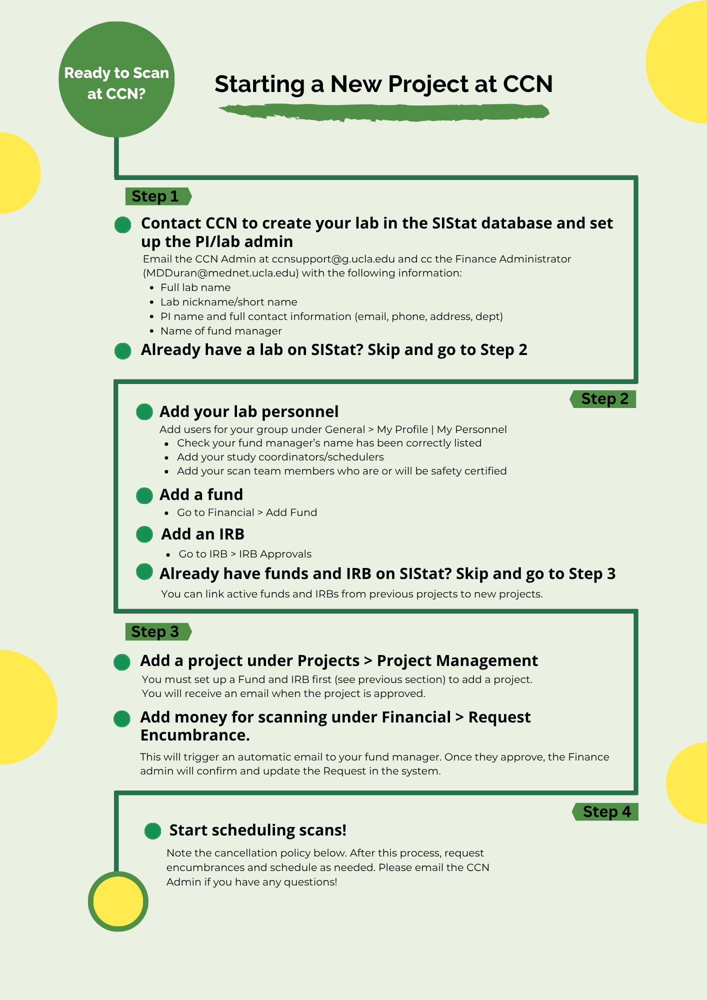
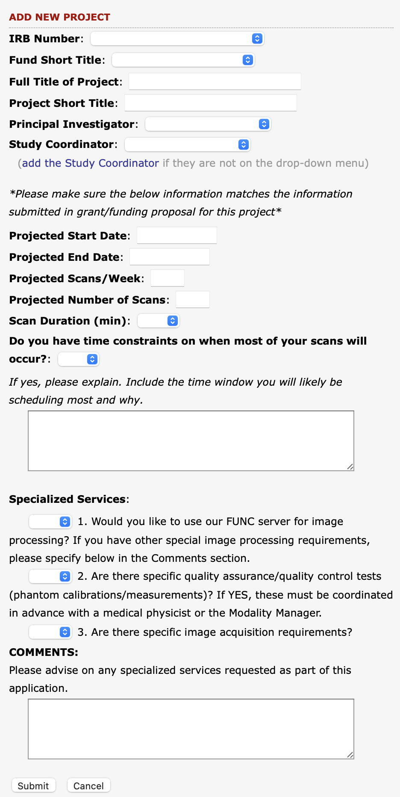
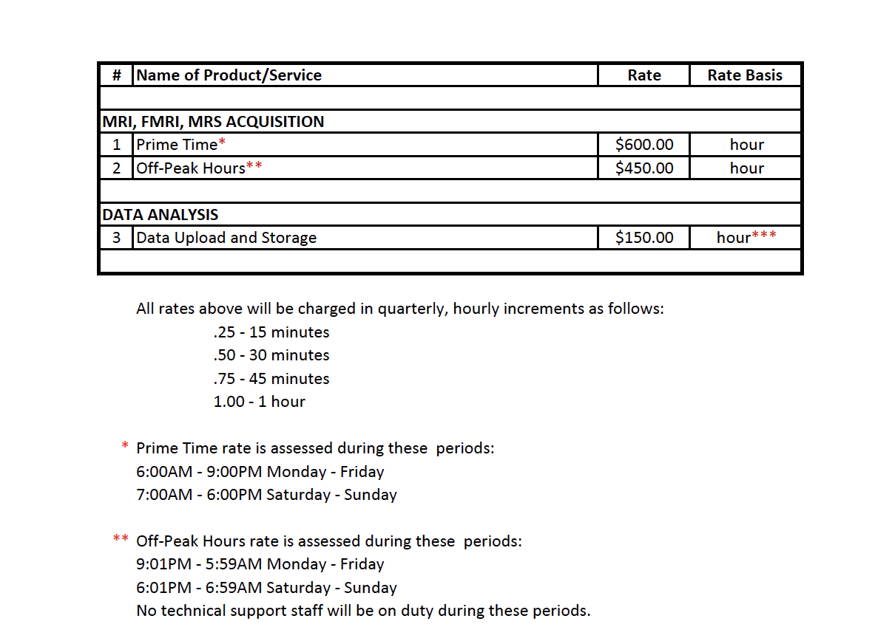
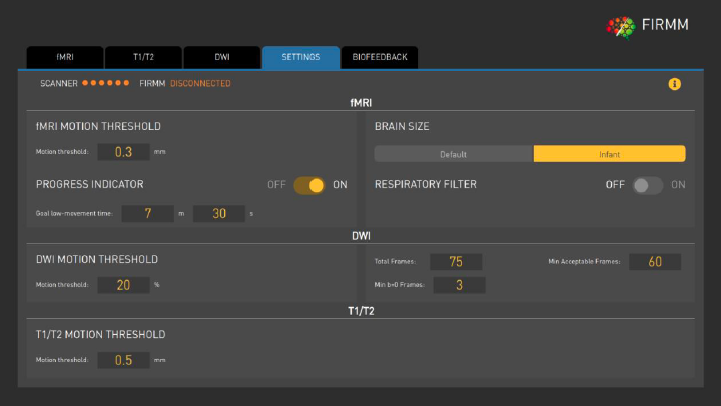
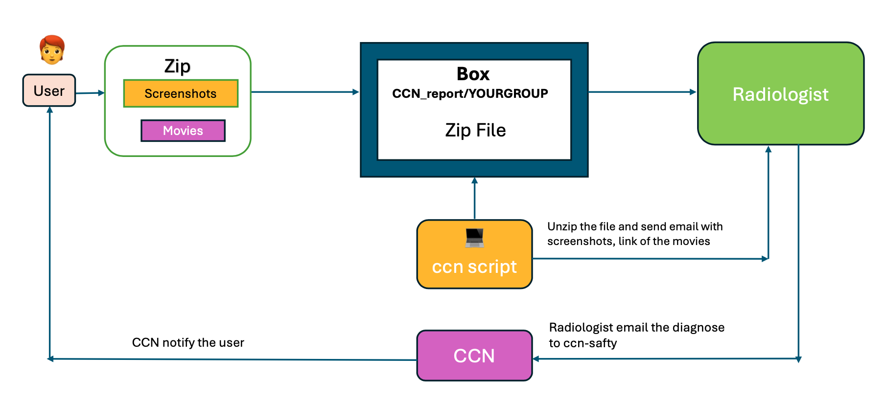

MRI 
===

On This Page
------------

| 🔹 :ref:`Safety Certification and Training <safety_cert>`
| 🔹 :ref:`Project Management <project-management>`
| 🔹 :ref:`Personnel Policies <mri-personnel-policies>`
| 🔹 :ref:`Scheduling Policies <mri-scheduling-policies>`
| 🔹 :ref:`Scan Facility & Equipment <mri-facility-equipment>`
| 🔹 :ref:`Scanning Procedures <mri-scanning-procedures>`

.. raw:: html

   

Safety Certification and Training
---------------------------------

.. _safety_cert:
1.1  How to Get Safety Certified
~~~~~~~~~~~~~~~~~~~~~~~~~~~~~~~
CCN safety certification is achieved using a combination of in-person sessions and remote work via the Staglin Safety and Training Course on `Bruinlearn <https://bruinlearn.ucla.edu/>`_. You can log into BruinLearn with your UCLA credentials, but will need an enrollment link to register for the Staglin Center Safety module for the first time. Ask your lab manager or check the #ccn-resources channel on Slack for the enrollment link. If neither source can provide it, contact CCN support. The enrollment link is not posted on this wiki for security reasons.

- Overview: The process is summarized as follows and the BruinLearn module will guide you through the steps once you begin:

   1. Review the safety materials, upload your metal screen form, and pass the MR Safety Exam (on BruinLearn).
   2. Book one matching pair of Walkthrough and Operations Training sessions on the BruinLearn calendar. The sessions should be one week apart. Booking only one session without the other requires explicit permission from CCN staff. Sign-ups for unmatched pairs or multiple sessions will be cancelled.
   3. Attend a Walkthrough Training session (in person at CCN).
   4. Submit the Walkthrough Worksheet and pass the Walkthrough Exam (on BruinLearn).
   5. Attend an Operations Training session (at CCN).
   6. Pass the Operations Exam (on BruinLearn).

- `Step-by-Step Guide <https://docs.google.com/document/d/1O_xt0fdFmxP1JE7NKGeT_fQSYbvwXxtdP51_UB-ksH4/edit?usp=sharing>`_: This document provides detailed explanations of all requirements related to safety certification and user status. It walks through the entire process of becoming safety certified, with screenshots, starting from the first step of accessing BruinLearn.

.. _renew_cert:
1.2  How to Renew Safety Certification
~~~~~~~~~~~~~~~~~~~~~~~~~~~~~~~~~~~~~
- Safety certification expires after one year. Every safety-certified user is required to renew their certification annually.
- To get recertified, log into BruinLearn, click "Modules" in the left-hand sidebar, and scroll down to the Recertification Module. Complete the two requirements:

   1. Submit an updated metal screening form to identify any new implants or devices that may preclude you from entering the MR environment.
   2. Pass the MRI Recertification Exam. No password is required.
   3. Email CCN staff as instructed in the module after completing both requirements.

- For procedural questions, first consult your labmates and the detailed guide above. Contact CCN staff about completed requirements, BruinLearn problems, or questions about the course material.

.. warning::

   **IMPORTANT:** If you have not scanned much or at all since your last certification, passing the Recertification Exam will not be sufficient to recertify you. *CCN will request that you repeat some or all of the full certification process.*

   This is an important precaution to make sure that every CCN user is familiar and up to date regarding safety protocols and equipment. If you have not been regularly scanning at CCN since you were last certified, email ccnsupport@g.ucla.edu to discuss your situation.

1.3  FAQ: Safety Certification
~~~~~~~~~~~~~~~~~~~~~~~~~~~~~

**Should I get certified if I do not yet expect to scan?**

 CCN supports training enough active team members to cover unexpected absences, but discourages certification solely for possible future use. If you scan little or not at all, you will need to repeat some or all of the certification process at renewal; see 1.2 How to Renew Safety Certification.

- CCN discourages the practice of having lab members get certified "just in case" when there is no realistic expectation that they will scan routinely. Pursue certification when you expect to begin scanning soon and remain active throughout the year. Regular scanning is critical for the user to remain familiar with safety procedures, problem solving, and emergency protocols.
- CCN supports the goal of training enough active team members to cover unexpected absences. Please be judicious in deciding which and how many lab members pursue safety certification.
- Once certified, make an effort to stay active and do not allow months to pass with no scan activity. If you do not scan much or at all after becoming certified, you will need to repeat some or all of the certification process at renewal; see 1.2 :ref:`renew_cert`.

**How do I renew a previous or expired certification?**

- If you have been actively scanning and your certification is current, follow 1.2 :ref:`renew_cert`.
- If you have not been regularly scanning or your certification has expired, email ccnsupport@g.ucla.edu. You will need to repeat some or all of the full certification process. Prior experience at CCN or another institution does not replace familiarity with CCN’s current equipment, emergency procedures, and training materials.

**I can log into BruinLearn, but don't see the Staglin Safety course.**

- This means you are not yet enrolled in the course. Please talk to your lab manager or admin for an enrollment link. Only email CCN staff if they do not have it. The enrollment link is sent to the PI and lab managers/coordinators when they are first certified at CCN and it is their responsibility to note and distribute it to future lab members who need certification.

**I got the enrollment link from my lab admin, but clicking it gives me a Page Not Found error.**

- If you only have/primarily use Mednet credentials, make sure you are trying to access BruinLearn properly. Go to bruinlearn.ucla.edu and click "Sign in with your Mednet username and password".
- Try again in 24-48 hours. UCLA credentials that were granted very recently to new employees/students take some time to propagate through the system.

**I passed the MR Safety Exam. Now what?**

- Monitor the BruinLearn calendar for Walkthrough and Operations Training sessions. Sign up for a pair of these sessions as soon as you see an available posting that you can attend.

**I'm on the Calendar page, but don't see any options to sign up.**

1. Click Find Appointments on the right side of the Calendar page. The guide in :ref:`safety_cert` illustrates this step.
2. If no appointments appear, the current sessions are full. Check for cancellations and new postings, and make sure BruinLearn email notifications are enabled if you want availability alerts.
3. If you have a strict deadline or have been unable to find a place despite repeated attempts, email ccnsupport@g.ucla.edu. Accommodations depend on scanner and staff availability and cannot be guaranteed.

**I finished my certification training and passed the exams. Now what?**

- Once you have passed the Operations Exam, you are able to start serving as a safety second for scans. There are no further exams to take or physical certificates to get. You will simply need to be recertified after a year has passed (see :ref:`renew_cert` above).
- Your lab admin will need to add you to your lab's personnel list on SIStat. See the Lab Personnel section on this page for instructions. This will allow us to mark your certified status in the system, your lab to schedule you for scans, and you to book scans yourself.
- After you have gained some experience as a safety second, you will be able to become a Primary or Responsible User. See the section about primary users on this page for qualification criteria. CCN does not stipulate a specific number of required experience hours, as everyone's MR background is different, but will assess each individual's experience level as necessary.
- Contact CCN staff for access to the CCN mailing lists and Slack workspace. These are the primary communication channels for CCN information and announcements.

**I am a certified user, but need a refresher on how to use the scanner console. Can I attend the Operations Training to review?**

- Yes, certified users may attend Operations Training as a refresher. Check the BruinLearn calendar and obtain CCN staff permission before signing up. Places are paired with Walkthrough sessions for new trainees, so staff must arrange an additional place for a refresher attendee.

**I am a certified Secondary User and want to become a Primary User, but my lab is currently not scanning (much). Can I obtain Primary User status before my lab resumes regularly scanning??**

- CCN generally discourages seeking Primary User status solely for possible future use, particularly if you are not currently scanning regularly. Contact ccnsupport@g.ucla.edu when you have a realistic timeline for serving as a Primary User. CCN will assess your readiness at that time.

**I am BMC certified. Will I need to get re-certified to be allowed in the CCN scanner and/or to access the CCN server?**

- Yes. CCN and BMC are separate organizations, so you will need to be safety certified at CCN to access the scanner and server.

**Will I get some kind of certificate after I finish safety certification?**

- No. This safety certification procedure is internal to CCN. It does not constitute any kind of approval to scan at other institutions and does not produce any literal certificates.

.. raw:: html

   

.. _project-management:
Project Management
------------------
SIStat (https://www.sistat.ucla.edu/ccnsas/login.asp) is the platform CCN uses to manage all scan-related activities. It is hosted by the Semel Institute Biostatistics Core and will serve as your hub for:

- Uploading your IRB approvals
- Encumbering funds so you can bill scans to your project
- Adding certified personnel to your lab/project
- Scheduling and cancelling scans

The diagram below shows how a new lab sets up a project in SIStat. For questions or help with Step 1B (CCN Administrator), email ccnsupport@g.ucla.edu and copy Marlo Duran at mdduran@mednet.ucla.edu.

2.1  Getting a SIStat account
~~~~~~~~~~~~~~~~~~~~~~~~~~~~
**New user under existing lab:** Your lab can create an account for you. See :ref:`add_user` below. This also applies to users who need to access SIStat, but do not scan (e.g., schedulers and fund managers).

**New user with new lab:** CCN will need to create your lab in the system, then add the PI. The PI can then add lab members from there.

2.2  Adding personnel to your lab
~~~~~~~~~~~~~~~~~~~~~~~~~~~~~~~~
Information about your current lab members can be found under General --> My Profile | My Personnel.

.. _add_user:
**Adding a New User**

The lab PI or coordinator should have administrative privileges to add new users to the lab.

1. Navigate to "General" → "My Profile | My Personnel"
2. Click the "User" dropdown menu and first check to see if their account already exists. This will be the case for most fund managers and users who are/were affiliated with other labs. If the user does not already exist, select "Create Passport For New User"
3. Input the new user's information. Only the bolded fields are mandatory. Either create a strong password for them or make a simple one they can change easily to a strong password of their own. Do NOT leave the password field blank.
4. The new user will receive an email with their login credentials.
5. If the user has just completed safety certification, the user or the person creating the account must email ccnsupport@g.ucla.edu to request activation and entry of the certification details. SIStat does not notify CCN when accounts are created. Wait for CCN’s confirmation before attempting to schedule the user as a Primary or Secondary User.

Every new user receives an email summarizing these instructions at the end of the certification process. These steps are also discussed verbally during the final in-person portion of the process (Operations Training).

**DICOM Accounts**

CCN maintains a DICOM server that raw imaging data is automatically transferred to as it is acquired. Each lab has their own directory. As such, lab members involved in checking/analyzing the data will need DICOM accounts to access their lab's folder. To apply for a DICOM account:

- Send an email with the following information to the CCN Programmer Analyst **Jonathan Hernandez (jonhernandez@mednet.ucla.edu)**
   - Your Hoffman2 account ID if you have one
   - CC your request to the PI whose group directory you need access to for approval
- It is possible to have a SIStat account without a DICOM account or vice versa. The user's role in the lab determines whether they need one, the other, or both.
- If you have an account with the Brain Mapping Center and want access to the CCN DICOM server, you will still need to apply for an account. CCN and the BMC are separate organizations and require separate accounts with separate policies.

2.3  Adding a new project
~~~~~~~~~~~~~~~~~~~~~~~~
All active projects must have complete project information in SIStat.

- New project: Go to Project → Project Management and complete ADD NEW PROJECT, including IRB, funding, PI, start and end dates, expected scans per week, total scan load, and duration.
- Existing project: On the same page, select Edit/View beside the project name and complete the information fields.

CCN uses these details to assess demand and accommodate projects with strict time constraints.

2.4  Funding & Costs
~~~~~~~~~~~~~~~~~~~~

**2.4.1** Scan Costs
^^^^^^^^^^^^^^^^^^^^

- Current pricing for the scanner is set at $600 per hour (incremented at $150 every 15 minutes) during "Prime Time" hours. Please note this is expected to increase to $650 per hour after our Sales and Service contract is reviewed.
- Scanning is priced at a reduced rate for "Off-Peak Hours" and Weekends

See the following table for a full list of pricing:

**2.4.2** Adding Funds
^^^^^^^^^^^^^^^^^^^^^^

To add a funding source, go to Financial → Add Fund and enter:

- Funding agency
- Active FAU
- Start and end date
- Fund manager responsible for the fund

New projects must be linked to active funds.

**2.4.3** Billing and Refunds
^^^^^^^^^^^^^^^^^^^^^^^^^^^^^

Scan Time: Labs pay for scans through linked funds. CCN may cover approved pilot scans; see :ref:`pilot`. Sales & Service permits no-charge scan time only for specific technical testing and protocol development approved in advance by CCN.

Refunds: Refunds are provided only for CCN-side issues (e.g., scanner problem) or exceptional events beyond the users' control (e.g., earthquake during scan).

Cancelled Scans: See Section :ref:`cancel_policy` below.

2.5 DICOM
~~~~~~~~~

To request a DICOM account, email CCN’s Programmer Analyst at JonHernandez@mednet.ucla.edu. Copy the IT Administrator at HaiyanWang@mednet.ucla.edu and the PI whose directory you need to access. The PI must confirm approval. Include in the email:

   1. The name of your lab
   2. The directory you need to access, typically named LASTNAMEGROUP
   3. Your Hoffman2 account ID, if you have one

2.5.1 Storage Policy
^^^^^^^^^^^^^^^^^^^^

Data is stored on the DICOM server for 5 years, then deleted. Data collected in the past calendar year or older may be moved to archive folders for space management. Please email ccnsupport@g.ucla.edu for help if you are having trouble finding data from the last calendar year (and up to 5 years old).

2.5.2 Accessing DICOM Using SSH - Command Line
^^^^^^^^^^^^^^^^^^^^^^^^^^^^^^^^^^^^^^^^^^^^^^

**Mac/Linux/Unix**

Use the ssh command from a terminal:

.. code-block::

   ssh login_id@dicomservername

where login_id is replaced by your user account ID. The server host name will be sent by email when you receive your account. For CCN, it should be dcm.semel.ucla.edu. You will then need to enter your dicom server password.

After login, you will be under your home directory, /user/userid/

To access the group directory, use

.. code-block::

   cd /path/to/group_directory

(/path/to/group_directory should be sent to you together with your account information) For CCN, this will be /data/dicom/your_lab_folder_name

**Windows**

Use a platform such as PuTTY for SSH terminal. See `Hoffman's documentation <https://www.hoffman2.idre.ucla.edu/Using-H2/Connecting/Connecting.html>`_ for instructions on how to connect and set up functionality (such as running GUI applications).

2.5.3 Accessing DICOM Remotely
^^^^^^^^^^^^^^^^^^^^^^^^^^^^^

To access DICOM from off campus, use either a Mednet-specific VPN or connect to Hoffman2 and then use SSH to connect to DICOM. A direct SSH connection through a general UCLA VPN, or without a VPN, will time out.

2.5.4 Sharing File Systems with Mac
^^^^^^^^^^^^^^^^^^^^^^^^^^^^^^^^^^^

You can mount the Dicom file system to your local Mac computer using SSHFS

Please follow these similar `instructions for Hoffman2 <https://ccn-wiki.readthedocs.io/en/latest/hoffman.html#sharing-filesystems>`_.

Usage:

.. code-block::

   sshfs -o idmap=user -o uid=1010 -o gid=20 userid@dicomserver:/path/to/groupdir ~/MOUNTPOINT

2.5.5 Copying Files to Hoffman2
^^^^^^^^^^^^^^^^^^^^^^^^^^^^^^^

Transfers from DICOM take longer while the scanner is in use because incoming scan data take priority. Check the scanner calendar and, when possible, download files outside scan hours or during gaps in the schedule.

**From SSH command line**

After logging in to Hoffman2, run one of the following commands from one of the Hoffman2 server

.. code-block::

   scp -r dicomuserID@dicomserver:/path/to/group_directory/subject /path/to/your_directory/

or

.. code-block::

   rsync -av dicomuserID@dicomserver:/path/to/group_directory/subject /path/to/your_directory/

**Script**

setup_subject script [page in progress] is used to copy files from Dicom to Hoffman2, and do other processing such as nifti convert.

2.6  FAQ: Project Management 
~~~~~~~~~~~~~~~~~~~~~~~~~~~~

**My IRB doesn't expire. Do I still need to put an expiration date?**

- Yes. For IRBs that do not require continuing review, CCN uses the expiration-date field as a reminder to check with the PI for changes to the protocol, consent form, or administrative details.

**How will my fund be billed?**

- CCN bills through recharge rather than a system such as Epic. Recharges are submitted in the month after the scan. This allows the MR Operations Manager to confirm that the session took place and the Finance Administrator to prepare the recharge documents for the fund manager to post to the general ledger.

.. raw:: html

   

.. _mri-personnel-policies:
Personnel Policies
------------------

3.1  User Rights
~~~~~~~~~~~~~~~~
All users have equal rights and privileges to conduct projects at the Center and must treat one another respectfully. Disrespectful conduct may result in suspension of scanning privileges. Users may contact the Executive Committee with questions or proposed policy changes.

3.2  Scan User Roles & Definitions
~~~~~~~~~~~~~~~~~~~~~~~~~~~~~~~~~~
Two MR-safety-certified investigators must remain in the facility throughout every scan. If a scheduled team member is unavailable, seek a replacement from your backup team, certified colleagues in other labs, or the CCN Slack #general channel. Request MR Technician assistance only as a last resort and arrange it in advance. Technicians are not required to be present for every scan and cannot be assumed to be available as backup.

.. note::
   At least one individual present is required to be a full-time/part-time staff, graduate student, post-doc etc. Part-time paid undergraduate researchers cannot presently act as primary users unless approved by CCN after additional review. Email ccnsupport@g.ucla.edu to request review. See below for a full breakdown of roles and permitted duties.

3.2.1  Primary User Definition
^^^^^^^^^^^^^^^^^^^^^^^^^^^^^^

**Allowable Roles:** Full-time staff, Post-doc, Graduate student, or Faculty member

- Also called "Responsible User"
- Leads the scan and operates the console
- Performs scan-related responsibilities independently
- Assigns tasks to and supervises the Secondary User, especially Volunteers

3.2.2  Secondary User Definition
^^^^^^^^^^^^^^^^^^^^^^^^^^^^^^^^

**Allowable Roles:** Any of the aforementioned full-time roles, Part-time paid/work-study students, volunteers

- Also known as "Safety Second"
- The scope of a Secondary User's permitted tasks depends on the user's employment status:

1. Full-time roles

   - Allowed to perform all responsibilities independently without supervision of the primary scanner
   - May perform all tasks except operating the console

2. Part-time paid undergraduate/work-study

   - May perform responsibilities explicitly defined in their UCLA approved job description independently without supervision
   - This can include operating the scanner, handling scanner and peripheral equipment, interacting with participants
   - May only serve as primary user with **additional review by CCN**

3. UCLA Volunteer

   - May NOT directly handle participants, coils, or operate MR beds/controls
   - Must ALWAYS navigate the CCN suite under strict supervision of the primary scanner/responsible user
   - May not serve as primary user
   - In the event of an emergency where the primary scanner is unable to perform their duties, volunteer personnel should be trained on stopping the scan and removing the participant
   - Required to undergo full CCN safety training
   - Must be officially onboarded via the UCLA Health Science Volunteer Office and perform duties according to the Staglin CCN Volunteer Addendum
   - See next section for details

3.3  Volunteers
~~~~~~~~~~~~~~~
All volunteers must complete onboarding through the `UCLA Health Sciences Volunteer Program <https://www.uclahealth.org/Volunteer/ucla-health-sciences-volunteer-program>`_. Go through the Clinical UCLA Health Sciences Volunteer Program even if your project does not involve clinical interventions or procedures. Anyone working with human subjects is considered Clinical where the Volunteer Office is concerned.

The PI or lab administrator creates the Opportunity, and the Volunteer Office handles the onboarding forms and signatures. The duties and responsibilites of the Volunteer are outlined in accordance with the `Staglin Volunteer Addendum <https://drive.google.com/file/d/1zPvjn6u_a6ogrXOi2bJVTLCrzhcw35qz/view?usp=sharing>`_. Please read it over carefully. In short: 

- Volunteers are not allowed to have direct physical contact with research participants or operate the scanner unless dealing with an emergency. Their role should be limited to tasks that do not involve handling the scanner or touching the subject, such as operating the task computer. This is true even for volunteers who have completed safety certification.

- All volunteers must still complete CCN's full safety certification process in order to serve as a Secondary User during scans at CCN. This is because, as Secondary Users, they must still be aware of CCN's protocols and prepared to respond in an emergency situation. In the event that urgent, life-saving action is needed, they must already be knowledgeable about emergency equipment and familiar with basic console operation (e.g., "which button stops a scan?"), even if they are not permitted to use it under normal circumstances. 

- Note that the copy of the Addendum linked above contains outdated contact information regarding the MRI tech. CCN has submitted updated information to the Volunteer Office and the documents they provide Volunteer applicants should be accurate.

.. note::

   A volunteer cannot become a Primary User, regardless of how much experience they gain. They must transition to another role if they wish to be a Primary User. A role that is paid in some capacity (staff, grad student, etc.) is most straightforward. Undergrad RAs and work study students may potentially be eligible, but must seek additional approval from CCN staff.

3.4  MR Technician Services
~~~~~~~~~~~~~~~~~~~~~~~~~~~
Staglin One Mind MR technicians maintain the MR facility and are available to support experimenters in developing scan protocols and troubleshooting scanner-related issues. If there is an anticipated need for support during scanning, experimenters must contact the technicians well in advance of the scheduled scan.

Contact information is posted in multiple areas throughout the Center (e.g., on the control room wall, by the Eyetracking computer) in the event of unanticipated issues during the scan.

.. _observers:
3.5  Observers
~~~~~~~~~~~~~~
Persons who have not completed safety certification are not permitted to observe scans or enter the magnet room for training or other purposes. For case-by-case exceptions with respect to scan shadowing, see the sections regarding CCN's Restricted Areas policy and :ref:`FAQ_personnel`.

.. _visitors:
3.6  Visitors
~~~~~~~~~~~~~
As per Staglin One Mind CCN safety protocol, visitors are not allowed in the MR suite without prior approval. Please email ccnsupport@g.ucla.edu to arrange a visit for external groups or individuals. CCN staff will need to set up an Event with UCLA Insurance & Risk Management and create a waiver for the visitors to sign.

.. _FAQ_personnel:
3.7  FAQ: Personnel Policies
~~~~~~~~~~~~~~~~~~~~~~~~~~~~

**Why am I not in the user dropdown list when scheduling a scan?**

- The most likely reason is that your safety certification has expired. You can see certification expiration dates in the My Profile > My Personnel page on SIStat. Users also receive an email reminder a month before expiration.

**Can an uncertified person shadow my scan?**

- Per the information above (see CCN's Restricted Areas policy), uncertified individuals are not allowed in the control room unless granted an exemption by CCN. Contact CCN for such an exemption if it's necessary for someone to shadow your scan. Regardless, the uncertified person is prohibited from touching any research equipment and any exemptions granted only apply to a single instance. Users who have started but not finished the certification process are considered uncertified until the full certification is completed. If you have questions about this, please ask.

**Can I be a primary user?**

- See "Scan Personnel" in section for general restrictions on user roles. Current CCN policy stipulates that primary users need to be full-time in some capacity (staff, faculty, postdocs, etc.), with a few exceptions for personnel such as faculty with part-time appointments.

- Primary Users are required to have significant scanning experience. The typical path to Primary status is to gain experience by scanning alongside existing Primary Users in the lab as Secondary Users (safety seconds). CCN does not stipulate a specific number of required scans because we understand that new users come in with different backgrounds and levels of scan experience. Once the Secondary User has become highly familiar with the setup/cleanup process and scan procedures, email ccnsupport@g.ucla.edu (cc'ing the PI and Primaries they have scanned with) to request Primary status.
- If your lab is new or has no current Primary Users for another reason, email ccnsupport@g.ucla.edu and explain your situation. You will need to find other ways to gain scan experience, which may involve scanning with and/or shadowing other labs. The situation becomes more complicated if you need to go from newly-certified to Primary User very quickly. Communicate early and closely with CCN admins to work out a plan.
- If your group needs an undergrad RA or work-study to become a Primary User, please email ccnsupport@g.ucla.edu for review.

.. raw:: html

   

.. _mri-scheduling-policies:
Scheduling Policies
-------------------

4.1 Rules and Policies
~~~~~~~~~~~~~~~~~~~~~~

The center does not mandate a strict limit on when scans can be booked relative to the scanning date. However, to foster cooperation and consideration within the community, booked scan times are assumed to be filled (assigned a participant) promptly and booked on an as-needed basis. Scans that are booked in advance, above and beyond the current scheduling norms, will be reviewed by the CCN staff and potentially cancelled. Under current policy, the scheduling rules are as follows:

**4.1.1**  No slot-holding
^^^^^^^^^^^^^^^^^^^^^^^^^^
Reserving a scan time and finding a participant later to fill it is not allowed. You must have a confirmed participant for each scheduled scan, at the time of scheduling. You will be required to enter a Subject ID when you schedule a scan, to verify you have a participant planning to use the slot. Conduct the recruitment process accordingly--for example, have the calendar open as you discuss availability with your participant and only book time that they agree to. Do not book time days, weeks, or months ahead with the intention of finding participants to fill them later. We understand that it may feel safer to reserve slots in advance, but many projects are actively scanning at CCN, and it only takes a few instances of this behavior to throttle scan opportunities for everyone.

**4.1.2**  Prime time scan limits
^^^^^^^^^^^^^^^^^^^^^^^^^^^^^^^^^
The scan limit is 3 scans maximum per project, per week, during prime hours (Mon-Fri, 8am - 6pm). This applies to every project unless you have made prior arrangements with CCN. There are no restrictions after hours (Mon-Fri, 6pm+; Weekends).

**4.1.3**  Appointment reminders
^^^^^^^^^^^^^^^^^^^^^^^^^^^^^^^^
Confirm with participants at least 5 days in advance of your scheduled scan. If your participant cannot commit to their participation 5 days out, please cancel your appointment at that time so other groups may be able to fill the opening. After reviewing cancellation patterns, it is evident that sessions cancelled ~72 hours or less do not give adequate time for other groups to fill the space, and hours of otherwise-usable time go to waste.

We understand that participants sometimes cancel last minute, no-show, or come in with unexpected safety concerns, but these occasions should be kept to an absolute minimum.

**4.1.4**  15-Minute Gaps 
^^^^^^^^^^^^^^^^^^^^^^^^
Scans cannot be scheduled for a time that would leave a 15-minute gap before or after another scan. This helps prevent small intervals of time from accumulating throughout the day and adding up to wasted usable hours.

The only exception is if the user wants to book time that would necessarily have to leave 15 minutes either before or after their reservation. For example, you may book 1-2pm even if the previous scan ends at 12:45pm and the next one begins at 2pm, because there is no way to avoid leaving 15 minutes open at one end or the other. This is permitted because using 60 of those 75 open minutes is preferable to leaving the entire time unused.

**4.1.5**  Subject ID
^^^^^^^^^^^^^^^^^^^^^
As mentioned above, the system will require a Subject ID to book a scan. This ID will be whatever lab convention you are using for the participant who will be coming for that slot (e.g., "ProjectA_Sub01"--DO NOT use the subject's name or any other identifying information).

**4.1.6**  Protocol ID
^^^^^^^^^^^^^^^^^^^^^^
You will also be required to enter a Protocol ID at the time of booking. This is the code that identifies the scan protocol you will be running. It will have the format XXX-X.X and is built into every active protocol name. You can find it on your protocol PDF or on the console computer when you pull up your lab's projects. There is no way to access this information remotely otherwise, so make sure your scan team has made a note of each active project's Protocol ID. DO NOT enter IRB or other numbers in this field.

**4.1.7**  Special Accommodations
^^^^^^^^^^^^^^^^^^^^^^^^^^^^
Investigators whose experimental needs do not fit these guidelines (e.g., if the study requires participants to have multiple scans within a specific time window) are encouraged to contact ccnsupport@g.ucla.edu and make specific arrangements.

.. _cancel_policy:
4.2 Cancellation Policy
~~~~~~~~~~~~~~~~~~~~~~~

There is no cancellation fee for scans cancelled more than 72 hours before the scheduled time. Simply log into SIStat and delete your booking from the calendar.

**Scans cancelled within 72 hours of the scheduled time will be charged 25% of the full scan fee.** If you need to cancel a scan within the 72-hour window, please fill out the `Late Cancellation Form <https://docs.google.com/forms/d/e/1FAIpQLSd5d9vuN6ii9h0W9BZ1C1-fspoS5VPB-oMDZHjyql8oSmywzg/viewform>`_ in addition to cancelling the scan in SIStat. The information collected on this form helps CCN monitor patterns to inform policymaking, as well as track cancellation events that merit fee refunds (e.g., fire evacuations).

.. note::

   Once the start time for your scan booking has passed, SIStat will not allow you to cancel it. As such, users should formally delete the scan through SIStat as soon as they know it cannot proceed (e.g., in cases that the participant arrives, but suddenly discloses a contraindication that was not previously known).
   
   Even if the cancellation occurs 5 minutes before the start time, the system will allow it and mark the session to be charged the 25% late cancellation fee. As soon as the start time passes, SIStat considers it complete and indicates the full charge should apply.

If a research group continually falls in the late cancellation range, CCN will ask for information to verify those slots were filled using appropriate scheduling practices. CCN may impose additional restrictions on scheduling (such as limiting the amount of scans that can be booked at one time) for groups that engage in profligate cancelling and/or reserving slots without confirmed participants. CCN has compiled a `list of best practices and recommendations <https://drive.google.com/file/d/1yLR77cLHod_-bwauu4AtoAq51bbiNUgv/view?usp=sharing>`_ regarding how to mitigate late cancellations.

Each funded project starts with two free cancellations and accrues another after every 10 completed scans. When a user cancels a scan late, the system will automatically use a free cancellation if one is available.

.. raw:: html

   

.. _mri-facility-equipment:
Scan Facility & Equipment
--------------------------

5.1 Facility Equipment
~~~~~~~~~~~~~~~~~~~~~~

CCN maintains the following equipment to support scan activities:

Peripherals
^^^^^^^^^^^

- Siemens intercom system
- Siemens physiological measurement system: pulse, respiration, and EKG
- Optoacoustic Noise Canceling Headphones: Thin profile headphones that fit in 32CH coil with active noise cancellation technology
- BOLDscreen Display: LCD display system controlled via fiberoptic cabling
- Current Designs Response Devices: 4-button, 2-button, and track-ball response devices
- FIRMM: Real-time motion monitoring system
- BioPac MP150: For collecting physiological measures including skin conductance, respiration rate, and pulse rate/waveform
- Eye Camera: Used to monitor wakefulness
- EyeLink 1000 Eyetracker: Used to monitor fixations and saccades

.. Retired:
   -VisuaStim digital system by RTC: Includes goggles/headphone/controller unit
   -These were the Restech goggles hanging off the side of the scanner until we disconnected and returned them 2026.
   -The rainbow box they connect to (I think?) was in the control room and the cables that run through the ceiling to the equipment room are still there. Robert, Agatha, Jillian, Patrick, and Melodie performed a CCN space cleanup on 7/29/26 and marked many unused items for storage, including the rainbow box, which we unscrewed from its old position under the cabinet.

Equipment Information for Grants
^^^^^^^^^^^^^^^^^^^^^^^^^^^^^^^^

- `Equipment List: <https://docs.google.com/document/d/1rVe6qlZc-OJyAQfnNBocZkbyBLlWMp5w/edit?usp=sharing&ouid=109365023269690384239&rtpof=true&sd=true>`_ See this document for a list of CCN's computing, imaging, and EEG resources.
- `Facilities and Budgeting: <https://docs.google.com/document/d/1h6KWkRL9wecYk9ib0Ok7jFTRw3bkeiCG/edit?usp=sharing&ouid=109365023269690384239&rtpof=true&sd=true>`_ See this document for sample language and useful information for writing grant applications.

On-Site Computer
^^^^^^^^^^^^^
The MR suite is equipped with a dedicated iMac computer running Mac OS High Sierra for the purpose of:

..  Coment: We used to have a dual-boot Windows 10 partition on the control room iMac, but retired it since no one uses it.

**Visual presentation:**

- PsychoPy (2 and 3) for basic tasks
- Netflix
- PowerPoint
- Crosshairs of various dimensions

If you need to install new software or images on the iMac, please contact ccnsupport@g.ucla.edu for permission and setup assistance.

**Scan management activities:**

- Scanner calendar to monitor time
- Playing music or white noise (can play your task audio if your task is run from the iMac as well)
- Pre- and Post-Scan surveys
- Providing safety and operational manuals for troubleshooting reference

.. note::
   CCN recommends using your own dedicated task laptop for running fMRI tasks.

   The iMac should only be used for very simple presentation jobs such as displaying crosshairs, playing movies, or running basic tasks via a compatible installed PsychoPy version.
   Relying on this computer to run your task means editing/troubleshooting your code will be more difficult (because you cannot access the iMac outside of CCN), your files will be susceptible to sudden changes in
   software without your knowledge, and any issues with/maintenance for the computer will advsersely affect your scan.

.. The following features were also listed in the original wiki, but I'm not sure they're still supported/advised:
   -Psychtoolbox
   -E-Prime
   -Matlab 2015b
   -AcqKnowledge 4 (for BioPac MP150)
.. The old wiki also says "To start up the dual-boot and access Windows, restart the iMac while holding down the Option key. You will need a password--contact CCN staff for it."
   What is this password? I don't have it in my Ops sheet.

5.2 Optoacoustics Noise Canceling Headphones
~~~~~~~~~~~~~~~~~~~~~~~~~~~~~~~~~~~~~~~~~~~~

Overview
^^^^^^^^

`OptoACTIVE II <https://www.optoacoustics.com/medical/optoactive-slender>`_ slim, over-the-ear headphones with an active noise cancellation (ANC) feature.

Please use the sanitary headphone covers located in the middle cabinet inside the scanner room. Do not clean the headphones with the wipes. Commercial cleaning products will cause the material to degrade and crack over time. We will then have to repair the headphones with electrical tape or replace them.

Noise Cancellation Setup
^^^^^^^^^^^^^^^^^^^^^^^^

1. Turn on power (top-right button on the back of the unit) and the display should appear (image 1 below). 
2. Make sure the audio cable isn't plugged into anything. Touch "Touch screen to continue" and then "Start" to move to the calibration screen (2).
3. Firmly touch "Calibrate" to begin calibration. During this step, absolute silence is necessary--no scanner noise and no audio. If calibration is successful, a green checkmark will appear next to the Left and Right calibration boxes. (3)
4. Once calibrated successfully, touch the ANC button in the upper right-hand corner of the screen.
5. Touch "Learn" to begin the algorithm's learning phase. (4) This sequence should be run before the task sequence and allows the noise cancellation algorithm to learn the noise coming from the scanner. If the audio cable is plugged in, make sure no audio is being played or else the learning will fail. The learning sequence should be at least 30 seconds long and should be the same exact sequence type being used for your fMRI tasks. (5)
6. Once the learning phase is complete, check that the yellow status box that said "Learn" is now green and says "Noise Cancellation". If it doesn't (e.g., it reads "Idle" or "Passive" instead), press the ANC button. The status should change and there should be a significant decrease in the scanner noise heard by the participant. (6) 
  - This is signified by the decrease in the dB value and the dB waveform seen on the screen for each ear.
  - Note that in Image 6, the red line is flat because the sequence had been stopped at the time the picture was taken. During your active scan with noise cancellation being performed, the red line should look similar to the blue line.
7. The algorithm will remain active unless stopped by the user or the system (see Troubleshooting).
8. Press STOP if you wish to pause the application of noise cancellation (e.g., to talk to the participant). Press ANC to start it again.
9. Press the switch on the back of the box to turn everything back off at the end of your scan. Leaving the unit on for long periods of time may cause it to exhibit unusual behaviors, such as struggling to turn back on again.

+---------------------------------------+-------------------------------------+-----------------------------------------+
| .. image:: images/opto_homescreen.jpg | .. image:: images/opto_start.jpg    | .. image:: images/opto_calibrate.jpg    |
|    :width: 150px                      |  :width: 150px                      |  :width: 150px                          |
|                                       |                                     |                                         |
|**Figure 1.** Home screen              |**Figure 2.** Press Start            |**Figure 3.** Calibration successful     |
+---------------------------------------+-------------------------------------+-----------------------------------------+
| .. image:: images/opto_learn.jpg      | .. image:: images/opto_learning.jpg | .. image:: images/opto_ANC.jpg          |
|    :width: 150px                      |  :width: 150px                      |  :width: 150px                          |
|                                       |                                     |                                         |
|**Figure 4.** System ready to learn    |**Figure 5.** 1.7 seconds until      |**Figure 6.** Cancellation active        |
|                                       | learning complete                   |                                         |
+---------------------------------------+-------------------------------------+-----------------------------------------+

Troubleshooting
^^^^^^^^^^^^^^^

See :ref:`trouble-opto` on the Troubleshooting page.

5.3 BOLDscreen 32" UHD LCD Display
~~~~~~~~~~~~~~~~~~~~~~~~~~~~~~~~~~

Overview
^^^^^^^^

Product site from Cambridge Research Systems: https://www.crsltd.com/tools-for-functional-imaging/mr-safe-displays/boldscreen-32-uhd/

Specifications:

- Active Area: 698.4 x 392.2 mm
- Pixel Dimensions: 3840 x 2160
- Refresh Rate: 60 Hz
- Pixel Pitch: 0.181 mm
- Contrast: 3000:1
- Luminance: 300 cd/m2
- Distance from isocenter: 121 cm

Setup
^^^^^

If everything is working correctly, setup should be quite straight forward. The BOLDscreen connects via HDMI or DislpayPort cable. Both are labeled "SCREEN".

- Plug in the display cable to the stimulus laptop or CCN iMac, and the BOLDscreen should mirror the display exactly.
    - Often an adaptor is required. CCN offers all the usual adaptors needed (HDMI to USB-C, Mini Display, VGA).
    - Please note the Mini Display adaptor only connects in one direction! This is important so you don't damage the display port on the iMac or other devices.
- There is an external monitor located to the right of the console computer, which should mirror the BOLDscreen so users are able to see what the participant sees. To connect to this monitor, connect the cable labelled "MONITOR" to the port on the box labelled "CLONE".

.. image:: images/AV_box.jpg
   :width: 50%

Troubleshooting
^^^^^^^^^^^^^^^

See :ref:`trouble-screen` on the Troubleshooting page.

5.4 Current Designs Response Devices
~~~~~~~~~~~~~~~~~~~~~~~~~~~~~~~~~~~~

Overview
^^^^^^^^

Product site from Current Designs: https://www.curdes.com/

- CCN is currently outfitted with five types of MR safe response devices: 2 Button Inline Box, 4 Button Inline Box, 4 Button Diamond Box, 4 Button Curved Box, and a Track Ball
- CCN is also equipped with a USB 4 button practice device for use in the testing room outside of the scanner: **This device is NOT MR safe and should not enter the scanner room at any time!**

Setup
^^^^^

1. The three response devices are located in a drawer inside the scanner room labeled "Button Boxes"
2. Take one of the devices and remove the small rubber cap located on the connector
3. Remove the top optical bundle from the wall, and remove the rubber cap from the bundle connector

  - Carefully put the two caps somewhere they won't get lost. The ledge of the window between the scan suite and control room is a good option, because you will see them when you loop the optical cable back up at the end of the scan.
4. Gently find the correct orientation for the two connectors to interlock

  - Once the correct orientation is found, connect the button box to the fiber bundle
5. Back in the control room, follow the instruction sheet attached to the desk above the silver button box interface in order to select the correct device and settings

  - Steps 3 and 5 will be different for the trackball mouse. Choose HHSC-TRK2 and HID TRACK COMP for those steps, respectively.
6. Once settings have been selected, please make sure your subject tests the buttons before continuing

Troubleshooting
^^^^^^^^^^^^^^^
See :ref:`trouble-buttons` on the Troubleshooting page.

5.5 FIRMM
~~~~~~~~~

FIRMM can track BOLD EPI, diffusion, and volume navigator (vNav) T1 and T2 sequences.

XA30
^^^^

FIRMM on XA30 is seamlessly integrated and starts automatically via settings in the BOLD, diffusion, and vNav sequences. No user input is necessary.

- If your project would like to utilize FIRMM, please reach out to CCN techs. The system is owned by a specific project and you will need permission to use it.

- A sequence must have the Dot Add-in applied to connect it to FIRMM.

   - Of note, there is a bug whereby using FIRMM disables the automatic copy reference feature. As the scan runs, you will be forced to double-click each referenced sequence to reopen it and re-apply the prescription before it will start. This can be done, but may introduce small differences in the FoV in your final data set. It is up to you to decide if the FIRMM/copy-reference tradeoff is worthwhile for your study.

   - As of August 2023, this is a known issue with Siemens workstations. Siemens is aware of the problem, but there is no confirmed resolution date.

.. image:: images/FirmmTablet.png
   :width: 50%

- If you made any changes to the FIRMM settings as part of your scan, restore them to the settings in the below screenshot. These are the settings used by the project that pays for the FIRMM license, so please respect their needs.

Troubleshooting
^^^^^^^^^^^^^^^
See :ref:`trouble-FIRMM` on the Troubleshooting page.

.. dropdown:: **VE11C - ARCHIVED**

   - Register a subject on the scanner (normal procedure).
   - Check the threshold value on the tablet (the dotted lines above and below the 0 line) and change the value under the Settings tab if desired.
   - Open up the Windows start menu (CTRL+ESC).
   - Right click on the 'FIRMM start one patient' towards the top of the menu and click open.
   - A pop-up will appear asking whether this file is secure, select 'Run'.
   - A new pop-up will appear that has a large 'CONNECTED' message.
   - Start your scan and participant motion metrics will appear on the FMRI, DWI, or T1/T2 tabs (if using vNav structural).
   - Note that the percentage reflects the aggregate motion metrics up to the current moment. If you're looking for the percentage that corresponds to only a particular series, tap "Show Series" and make sure only the one you're interested in is checked.
   - No need to take any further action when your scan is complete. If the next group intends to collect FIRMM data, they will start the process again (register patient, right click "FIRMM start one patient", etc.) and the tablet will automatically sync with the new functionals as they are acquired.

.. dropdown:: **Research FIRMM (decommissioned)**

   Make sure Advanced User mode is enabled - You will know it is if the MARS_SSH shortcut is visible on the start menu.
   
   To begin FIRMM:
   
   - Press CTRL+ESC on console --> STOP FIRMM Session
   - Register your participant.
   - Press CTRL+ESC on console --> START FIRMM Session
   - Close out of terminal and X11 on the iMac.
   - Go to "XQuartz" or "Terminal" menu at the top left of the screen, then scroll down and click "Quit"
   - Double click "FIRMM.command" icon on desktop. This should open up the terminal.
   - Type FIRMM into command line and press Enter.
   - Terminal should start spitting out lines, X11 should open up and you should see a message on the terminal window that says "Waiting for DICOMs..."
   - Click on the Start button on the X11 FIRMM application window.
   - When your functional scan starts, volumes should start appearing after ~45sec delay.

5.6 Eye Camera
~~~~~~~~~~~~~~

The camera feed adaptor should be located on the desk behind the console monitor.

- Make sure the camera feed is plugged into the yellow component of the adaptor, and the USB is plugged into the CCN iMac.
- Open up the ezcap VideoCapture software on the CCN iMac.
- If the ezcap application is already open, quit and reopen before moving on. Sometimes the USB is not read properly if opened before connecting USB.
- After opening the program two windows will popup, these are normal.
- Navigate to the top of the screen and click on the Digitizers menu and select ezcap VideoGrabber. This should bring up a video feed in a separate window.
  
  - If this doesn’t work, restart the ezcap VideoCapture software and try again.
  - If no video feed is present, please email the MR Tech.
- CCN has a camera attached to the top of the bore in the instance research groups would like to monitor their subject's wakefulness but have no need for the eye tracking metrics.

.. image:: images/EyeCameraAdaptor.png

5.7 Eye Tracker
~~~~~~~~~~~~~~~

MR Compatible EyeLink 1000
^^^^^^^^^^^^^^^^^^^^^^^^^^

CCN is equipped with an in-bore `EyeLink 1000 Plus - Long Range <https://www.sr-research.com/fmri-meg-systems/>`_.

.. image:: images/Image-size-projector-screen.png

.. image:: images/Eyelink-in-scanner-eye-to-screen-distance.png

Setup
^^^^^

**In Scanner:**

The eyetracker is installed in the back of the bore. It should stay behind the blue tape marking the best position on the rail.

There are three cables that need to be attached when you begin an eyetracking session:

- Two thick, black cables: Power cables. Plug them into the two round ports on the back of the eyetracker (doesn't matter which one goes on which side).
- One skinny, orange cable connected to a blue cable: Fiber optic cable. Plug it into its port on the back of the eyetracker.
- Remove the lens cap. Place it somewhere nearby so you can find and replace it again easily when your scan is complete.
- There is another camera mounted to the inside of the bore, right above the eyetracker. You may want to unplug this camera before you being your eyetracking session, as the infrared light it emits may interfere. If you unplug this camera, please remember to plug it back in when your scan is finished.
- If your group is finding it difficult to re-plug the camera after scans, whether it be due to time or memory constraints, you may find it helpful to simply cover the camera using one of the mesh headphone covers. This is an acceptable alternative as long as you are mindful not to use an excessive number of covers per week.
- At this point, the Eyelink desktop computer in the control room can be turned on. The camera now needs to be aligned so that it points at the participant's (usually right) eye, reflected in the mirror.
- Remember to use the mirror dedicated to eyetracking, not the usual coil mirrors. The eyetracking mirror is stored in the control room cabinet and labelled with EYETRACKER.
- Do not clean this mirror using the wipes. They will degrade the reflectiveness over time. Use the special cleaning products stored in the same cabinet that the EYETRACKER mirror itself is kept in.
- Once the participant is inside the bore, adjust the alignment as necessary. You may need to play around with both wheels until a stable image is achieved:
  - Wheel close to lens: Focus wheel.
  - Wheel close to base: Aperture wheel.
  - Large knob near the base: Adjust eyetracker positioning in all directions.

**In Control Room:**

At the Eyelink station on the right side of the room, there is a cable with a yellow tag on it and is attached to a battery box labelled EYELINK (pictured below). This is the transducer cable--plug it into the rightmost port (labelled with "12V") on the box on top of the tower unit.

.. figure:: images/EYELINK_transducer.jpg

   Transducer cable plugged into the Eyelink box.

- Plug the eyetracker ethernet cable into your task computer. This will be the blue cable labelled EYELINK.
- Make sure your computer network is set to use this connection. This will be how your computer communicates with the Eyelink station to run calibration and record fixations when your scan starts.
- Once the cables are connected to the eyetracker in the bore, turn on the tower unit. You will likely get errors if you try to power on before those cables are connected.
- The main Eyelink menu screen should appear, now that all the cables are connected and the computer is powered on.

**Calibration:**

- Click on the center of the eye to put the red circle around the pupil.
    - Set the thresholds so that the cross locks on to the center of the pupil and maintains as stable a tracking as possible:
    - Start by clicking "Auto Threshold". Eyelink will give you its best estimate of what threshold values give you the most accurate capture of pupil and corneal reflection.
    - Adjust the pupil threshold until the dark blue (pupil) fills as much of the pupil as possible without including too much non-pupil (e.g., eyelashes).
    - Adjust the CR threshold until the light blue (corneal reflection) circumscribes a spot on the pupil without including too much non-CR (e.g., the coil).

- Once the threshold settings are as stable as you can get them, click "Calibrate" on the right side of the screen to begin calibration.
    - The details of running the calibration will depend on how the corresponding script is written on your task computer's side. You will need some code that tells Eyelink when to present a fixation cross and when to accept fixations.
    - This can be a relatively simple Matlab script with just a few commands for having the user decide when to show a cross, accept a fixation, show the next cross, and exit the script when calibration is done.
    - "Auto-trigger" is off by default. You will most likely want to keep this off.
    - Other settings will depend on your lab's preferences. For example, there are different calibration types that will present fixation points in various configurations, such as a row of three, a triangle, a five-point cross, or a full-screen grid. "Force Manual Accept" will tell Eyelink that you want the program to wait for you to press a key in order to accept the calibration attempt on a particular fixation point before moving on. There are a number of other settings--make a note of what your lab wants to do so it will be consistent across all your participants.
    - If you are using manual accept, you generally want to accept a corresponding fixation very quickly after presenting a cross. This is because a person's immediate saccade to a new fixation point tends to be the most accurate. Once they fixate, the eye often drifts off even if the person feels like they are still focused on the cross.
    - During calibration, the crosses look like they appear at the edges of the screen while the fixations do not. This is normal--the fixations will look clustered around the center of the screen, but as long as they make a generally rectangular shape, calibration is working correctly.

- Click "Accept" and "Validate" to validate the calibration once it's complete. This will run you through another (similar, but not identical) process to verify the calibration results.

.. _mri-scanning-procedures:
Scanning Procedures
-------------------

.. _pilot:
Pilot Program
~~~~~~~~~~~~~

CCN will consider proposals by members of the UCLA community to access both the scanning and analysis core services for pilot studies without charge to the investigator. Priority will be given to junior investigators and to proposals for novel cognitive neuroscience projects that have a high likelihood of achieving extramural funding. 

See the `Pilot Application here <https://drive.google.com/file/d/1rhfezXO3QP4pV5yjUnNmI8LNkjw7EqS9/view?usp=drive_link>`_. Fill out the application if you would like to apply for scan hours toward a pilot project. Send the completed form to alenarto@g.ucla.edu and be sure to inform CCN about the outcome of the pilot--if it helps you successfully secure funding, this information is crucial to keeping the pilot program going!

The proposal will be reviewed by the Executive Committee members and CCN personnel will contact you regarding the status of the submission. As stated in the application, if you need more space than provided for any item within please use a Word document to submit your answers.

.. note::
Please still consider `CTSI <https://ctsi.ucla.edu/funding-opportunities>`_ for funding opportunities. 

Metal Screening and Safety Clearance
~~~~~~~~~~~~~~~~~~~~~~~~~~~~~~~~~~~~
All participants need to be diligently screened for contraindications to MR imaging during recruitment. Review and sign the `Metal Screening Form <https://drive.google.com/file/d/1aUwmgXoij_czd8YktXmo0yDLjpqbuUpm/view?usp=sharing>`_ with each participant for each scan session. If there are any items of concern, follow up with your participant for more information, collect all relevant documentation from them and/or their medical team, and pass everything along to CCN staff for a final decision. Do not ask CCN about your participant's implant or device without first researching the relevant background. 

All implants needs to be cleared by CCN *before scanning*. If your participant has an implant, please follow the `instructions <https://docs.google.com/document/d/13g-DVRauCgZAkScw0D5j03cCPeCiu2Fi/edit#heading=h.rgb25in7p2nc>`_ to submit a ticket in our `ticketing system <https://support.idre.ucla.edu/helpdesk/>`_ for clearance. Please keep in mind:

.. warning::
   At least six weeks must pass after any surgical procedure before your participant can be considered for scanning.

.. danger::
   No tattoos or other permanent cosmetics on the face or head. The ONLY exception is microbloaded (NOT tattooed) eyebrows.

   Submit a clearance ticket for any other tattoos your participant may have. Just be aware that permanent ink of any kind on the face or head (except microbladed eyebrows) automatically disqualifies your subject.

Developing & Testing a Scan Protocol
~~~~~~~~~~~~~~~~~~~~~~~~~~~~~~~~~~~~

Protocol Development
^^^^^^^^^^^^^^^^^^^^
CCN can assist you with developing and refining a scan protocol at no charge.

If you need CCN staff to help you with creating and designing the protocol on the console computer, reach out to ccnsupport@g.ucla.edu with the following information:

- Name of lab and PI
- Name of existing or new project you want this protocol to be organized under
- Description of desired sequences with as much detail as possible (TR, number of volumes/measurements, resolution, etc.)
- All resources from other protocols that can be used as references (e.g., PDF and/or .exar1 file from another study you ran and would like to closely emulate)

The more information you can provide up front, the more work CCN staff can start doing whenever the scanner is available. References from other protocols will be especially helpful to speed things up as a starting point.

CCN will grant your SIStat account uncharged time that you can use to schedule development time on the calendar. This time will need to be coordinated with CCN staff and take place during regular business hours.

If you do not need assistance from CCN to build your protocol, still reach out to ccnsupport@g.ucla.edu to keep staff appraised of the situation. You will need an actively certified Primary User who is familiar with the XA30 software and comfortable with responsibly navigating the MR environment. CCN staff will also need to grant you time for reserving a development session on the calendar. Please make every effort to prioritize off-hours (evenings and weekends).

.. _protocol-testing:
Protocol Testing
^^^^^^^^^^^^^^^^
Once you have a workable protocol, you will need to run through it in its entirety. CCN has phantoms available for this purpose. Please reach out to CCN staff for phantom scanning with tech assistance. Even if scanning independently with an experienced team, please still keep CCN notified (especially if you will be needing a phantom other than the standard Siemens bottle).

Each new project is permitted two free scan sessions with a human phantom for the sole purpose of ensuring that the full setup is functional. The group is responsible for recruiting their own test participant, whose images cannot be used as publishable data, and who must still undergo safety screening despite not being included as a real study participant.

All such scans must be booked with free Development/Practice time, assigned by CCN personnel.

Running a Participant Scan
~~~~~~~~~~~~~~~~~~~~~~~~~~

**5.5.1**  Infection Control
^^^^^^^^^^^^^^^^^^^^^^^^^^^

Please make sure the participant completes the `Pre-Appointment Illness Screening Form <https://drive.google.com/file/d/1kXsq_b25apk08NTTJ82GWX4adjsyz_iq/view?usp=sharing/>`_ before arriving at UCLA. You should administer this form either the night before or the morning of their scan appointment. Many other researchers, staff, research subjects, and family members come through CCN, meaning we need to minimize the potential for unknown infections floating around the Center. If your participant fails to clear the illness screening, please reschedule their appointment.

Past guidance for infection control policies can be found `here <https://drive.google.com/file/d/18CiRxYb4VmBn4z3tE7jADcGV5wBg4-xb/view?usp=sharing>`_. This is archived to document the policy changes that were implemented to safely navigate the COVID-19 restrictions. Most policies described within no longer apply, but some (e.g., handwashing upon arrival at the Center) were retained.

**5.5.2**  Participant Arrival
^^^^^^^^^^^^^^^^^^^^^^^^^^^^^

Please make sure that your study participants have a direct contact readily on hand and that lab personnel will be available to respond promptly to calls, texts, and emails as the scheduled appointement time approaches.

If a participant arrives early and you are part of their research team, make sure someone is available to communicate with the person and help give directions in case they are having trouble finding the suite. Once they are at C7-439, direct them to wait on the bench right outside CCN until lab personnel meets them and brings them inside. Generally, study participants should not be sitting in the CCN lobby unattended. This increases the risk of their wandering into restricted spaces or seeing information from other labs working in the area that they should not be privy to.

If you are in CCN and someone unexpectedly rings the doorbell saying they are here for a scan, it is up to you if you have the time to ask questions and help them get in touch with their research contact. Regardless, you should still ask them to wait on the bench outside CCN.

Do NOT let someone in just because they claim to be here for research. The presence of the powerful magnet means that access should be highly controlled. You should only let in participants you are expecting, your certified labmates that you recognize, and people explicitly permitted by CCN (e.g., helium refill tech).

Do NOT rely on CCN staff to let your participant in if they arrive early. CCN admins are in and out of the suite, scanner room, and equipment room all day and may not hear the doorbell. Moreover, they are not responsible for standing at the door with your participant and investing time to figure out who they are supposed to be meeting. 

**5.5.3**  Scan Start & End Time
^^^^^^^^^^^^^^^^^^^^^^^^^^^^^^^^^

All scans are expected to start and end promptly at the scheduled time. Start and stop time includes setup and cleanup, meaning users must build this into their scanner scheduling (i.e., the lab must have the scanner ready for next group, not just starting to clean up, by the scheduled end time).

All users have the right to start their scan on time, no questions asked.

When possible, try and be flexible. However, if the next group is adamant about starting their scan at the scheduled time, then it must be so. If the current scan is running late, **the current group must make an effort to inform the next group**. The next group may then, at their discretion, allow the current group to scan into their allotted time, but this is done as a courtesy and not out of expectation that the next user will provide the same. Please watch the clock carefully and  approach the next group for accommodations ASAP if you need more time. Do NOT simply scan past your scheduled time and put the onus on the next group to approach YOU and ask you to finish up.

CCN periodically audits the schedule and keeps track of all pre- and post-scan reports. Projects that continually run over time will be required to book more time for future scans.

**5.5.4**  Data Transfer & Storage
^^^^^^^^^^^^^^^^^^^^^^^^^^^^^^^^^^

All f/MRI data are transferred automatically to a dedicated remote server as it is acquired. There is no further action required during or after a scan to send your data to this DICOM server.

If data is not accessible in the DICOM server 24 hours after acquisition, please contact MR Technician immediately to resolve. Due to high scan load, only 2 days of scan data can be guaranteed to be kept on the host machine at any given time. The onus is on each lab to check DICOM after each scan and make sure all images have transferred successfully. Data typically finishes transferring within several hours of the scan's end time, but at a minimum should be present and complete by the following morning. It is not CCN's responsibility to check that each data set has transferred to the server without issue.

Data is stored for 5 years on the remote DICOM server before being deleted. However, Data collected in the past calendar year or older may be moved to archive folders for space management. Please email ccnsupport@g.ucla.edu and cc HaiyanWang@mednet.ucla.edu for help if you are having trouble finding data from the last calendar year (up to 5 years old).

In cases where data must be transferred manually from any of the computers in the MR suite, please notify the MR Technician to make arrangements. No external storage devices (flash drives, hard disks, etc.) are to be connected to the scanner without prior approval.

**5.5.5** Incident Reporting
^^^^^^^^^^^^^^^^^^^^^^^^^^^^

Users are responsible for communicating with CCN staff any equipment malfunction or software irregularities that occur during the course of the scan session. This includes scanner error messages which do not allow users to continue with their session, the breaking or malfunction of peripheral equipment, and so on. The pre- and post-scan forms on the iMac will ask basic questions about the state of the suite and equipment.

Emergency incidents, such as injuries, natural disasters or magnet quench, should be relayed to the MR Tech immediately and CCN's `Incident Reporting Form <https://docs.google.com/forms/d/e/1FAIpQLSckiYXnkzlWcYBfD6BEGTV60Tb36Jj2680Tq8mdw02auoFiKQ/viewform>`_ should be filled out in a timely manner.

Staff will be on-site during regular hours. If they have stepped out for deliveries, meetings, lunch, etc. please send a Slack or phone message. Contact information (including the appropriate after-hours call tree) is posted on the control room wall.

Incidental Findings
~~~~~~~~~~~~~~~~~~~

A neuroradiologist is on CCN retainer for reviewing potential incidental findings. **To be clear, you may only submit images for incidental finding review if you have this explicitly described in your approved IRB protocol.** As a reminder, CCN is not a clinical facility, and other than our collaborating neuroradiologist, no CCN faculty or staff are medically trained. For sample language, please refer to the `OHRPP's Consent, Assent, and Screening Templates <https://ohrpp.research.ucla.edu/consent-templates/>`_, in particular the section of the `Biomedical Research Consent Form Standards and Sample Language <https://ucla.app.box.com/v/FR-05f01-Biomed-ICF-Stand-Lang>`_ document addressing clinically relevant results.

**How to report incidental findings:**

1. Create a folder and put in all your images and movie files you want to send to the radiologist. *Please circle the area that you consider anomalous.*

   - The images should include T1 and T2, and are saved in png or jpeg/jpg formats.
   - (Optional) You can create a "movie" from MRI images to give the radiologist with a fuller, 3D view. This is not required, but often useful in providing more detailed information for the review.
       - CCN offers a script that will create this movie from a nii.gz folder of structurals: gen_movie.py
       - You may also create the movie using your own program. Just be sure it can be paused, replayed, and so on (e.g., a mp4 file). Animation files (e.g., gifs) will not allow the radiologist to carefully inspect the area of concern and are therefore of less informational value.
   - Name your folder that contains all the files with your lab name and subject ID. 

2. Compress the folder with zip, and make sure it's named with your lab name+subject ID.

   - The compressed file should end with ".zip"
   - If you do not zip your folder, the automated script that checks daily for new submissions will not detect it.

3. Upload the zip file to the Box folder, “CCN_report/YOURGROUP”, which should be shared with your lab.

   - If your lab does not yet have a Box group folder shared by us, please contact ccnsupport@g.ucla.edu (confirming your IRB permits these reviews) so we can set one up for you.
   - Before you upload the files, please make sure the images and videos are in good quality so the radiologist can make the correct decision based on them. No phone pictures of computer screens.

4. What will happen after you upload the zip file:

   - Our script will check the Box folder once a day, and if there is a new zip file, it will be unzipped and sent to the radiologist with the images attached. The link for the movie file will also be included.
   - CCN will forward the radiologist's read to your PI. Regardless of who submited the materials, only the PI will receive the review.

